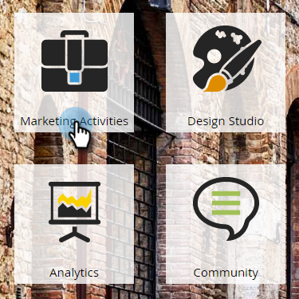
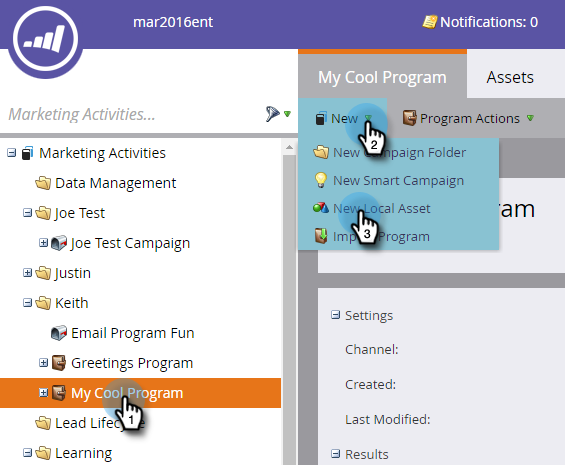
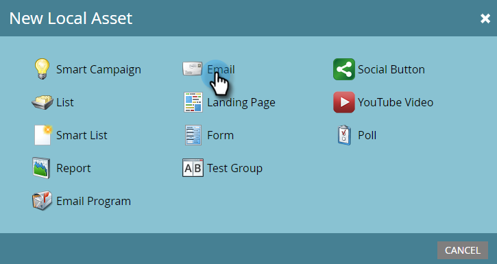
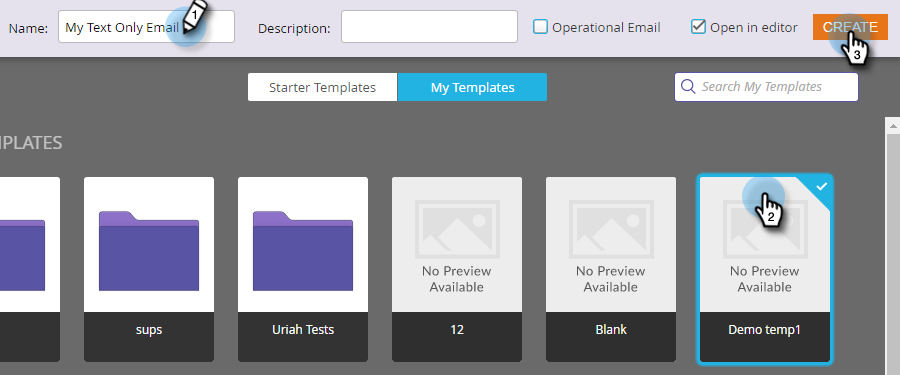
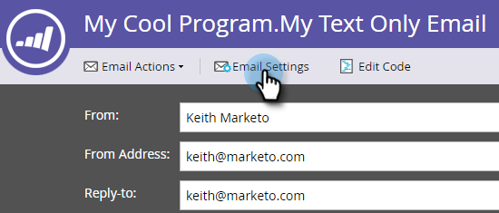
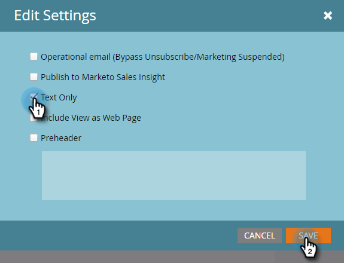
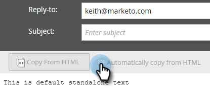
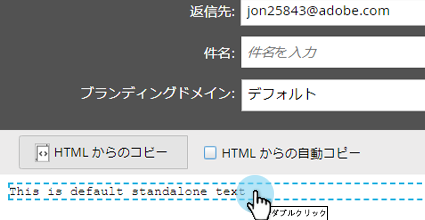
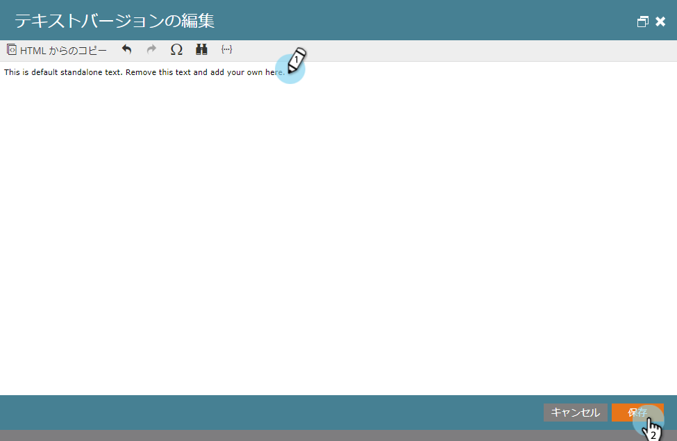

# テキストのみのメールを作成する {#create-a-text-only-email}

テキストのみのバージョンのメールを送信したい場合は、HTML コンテンツを使わずにメールを作成できます。

>[!NOTE]
>
>開封は、メールの画像（非表示のトラッキングピクセルを含む）をダウンロードする受信者によって追跡されるため、テキストのみのメールでは開封を追跡&#x200B;**できません**。

1. 「**[!UICONTROL マーケティング活動]**」領域に移動します。

   

1. お使いのプログラムを選択し、「**[!UICONTROL 新規作成]**」ドロップダウンで「**[!UICONTROL 新規ローカルアセット]**」をクリックします。

   

1. 「**[!UICONTROL メール]**」を選択します。

   

1. 「**[!UICONTROL 名前]**」にメールの名前を入力し、テンプレートを選択して「**[!UICONTROL 作成]**」をクリックします。

   

1. メールエディターで、「**[!UICONTROL メール設定]**」をクリックします。

   

1. 「**[!UICONTROL テキストのみ]**」にチェックを付けて、「**[!UICONTROL 保存]**」をクリックします。

   

   >[!CAUTION]
   >
   >リンクは、テキストのみのメールでは自動的には追跡されません。 「[テキストメールにトラッキングリンクを追加する](/help/marketo/product-docs/email-marketing/general/functions-in-the-editor/add-tracked-links-to-a-text-email.md)」を参照してください。

   >[!TIP]
   >
   >既存のメールについても、編集してこの設定を変更できます。 ドラフトの承認を忘れないようにしてください。

1. 「**[!UICONTROL HTML からの自動コピー]**」のチェックを外します。

   

   >[!NOTE]
   >
   >メールのHTML セクションに追加されたコンテンツは、送信時に無視されます。

1. テキストエリアをダブルクリックします。

   

1. テキストを編集して「**[!UICONTROL 保存]**」をクリックします。

   

それくらい簡単です。
