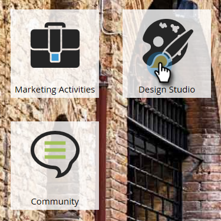
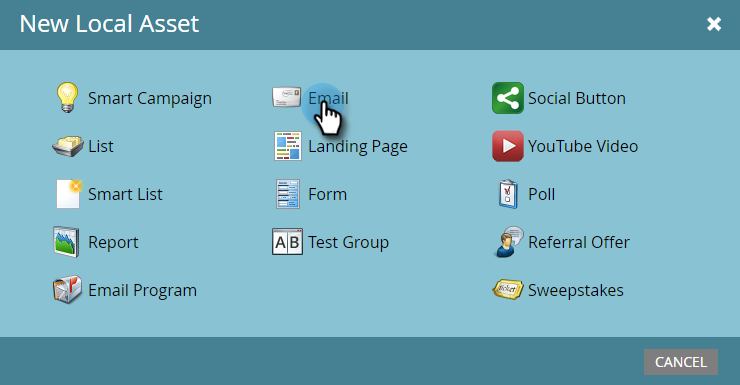

# メールを作成する {#create-an-email}

Marketo でメールを作成する方法は主に 2 つあります。両方を見てみましょう。

## Design Studio でメールを作成する {#create-an-email-in-the-design-studio}

1. **Design Studio** に移動します。

   

1. **新規作成**&#x200B;ドロップダウンをクリックして、「**新規メール**」を選択します。

   

   >[!NOTE]
   >
   >Design Studio でメールを作成すると、「メール」の下のツリーに表示されます。

シンプルです。もう 1 つは…

## マーケティングアクティビティでメールを作成する {#create-an-email-in-marketing-activities}

1. 「**マーケティングアクティビティ**」に移動します。

   

1. メールを追加するプログラムを選択し、**新規**&#x200B;ドロップダウンをクリックして、「**新規ローカルアセット**」を選択します。

   

1. 「**メール**」をクリックします。

   

   これで手順は完了です。

どの方法を選択しても、テンプレート選択ツールが表示されます。

1. メールに名前を付け、使用するテンプレートをクリックして、「**作成**」をクリックします。

   

   >[!NOTE]
   >
   >すぐに使えるレスポンシブメールテンプレートのコレクションか、まず「**マイテンプレート**」を選択し、同じ手順に従って保存したテンプレートから選択できます。

1. 件名を入力します。お勧めの最大 50 文字を下回っている場合は、右側にカウンターが表示されます。

   

   選択したテンプレートに応じて、メールを編集するための様々なオプションが表示されます。モジュールを含むメールの場合は、「[モジュールをメールに追加する](/help/marketo/product-docs/email-marketing/general/email-editor-2/add-modules-to-your-email.md)」を参照してください。

これでメールが作成されたので、編集します。

>[!MORELIKETHIS]
>
>[メールヘッダーを編集する](/help/marketo/product-docs/email-marketing/general/creating-an-email/edit-your-email-header.md)>
>
