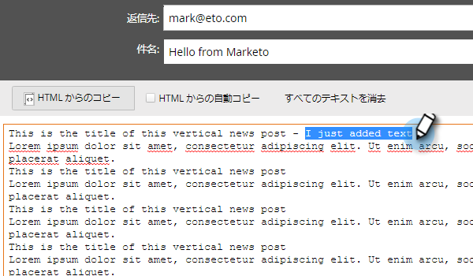

# 電子メールのテキストバージョンの編集 {#edit-the-text-version-of-an-email}

電子メールを作成する際に、HTMLバージョンとは別のテキストバージョンを使用したい場合があります。 デフォルトでは、Marketorは、電子メールに含まれるリッチテキスト要素のテキストコンテンツを自動的にテキストバージョンにコピーします。 編集方法を次に示します。

>[!NOTE]
>
>これは、テキストのみの電子メールの作成に関する記事ではありません。 詳しくは、「テキストのみの電子メールの [作成](create-a-text-only-email.md)」を参照してください。

1. 電子メールエディターで、電子メールの下部にある「 **テキスト** 」タブをクリックします。

   

1. 「** HTML**から自動的にコピー」をオフにして変更します。

   

1. テキスト領域を重複キーを押しながらクリックします。

   

1. 編集を行います。 完了したら、エディターを閉じるか、HTMLバージョンに戻ります。 変更は自動保存されます。

   \
   静的コンテンツのみを持つ場合、テキストは1つの大きなブロックで編集できます（手順3を参照）。 動的なコンテンツがある場合、テキストは、以下に示す様々な編集可能なセクションに分割されます。

   

今だ！
