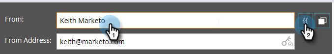
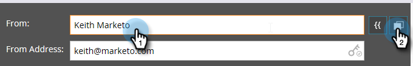
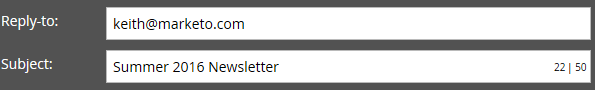
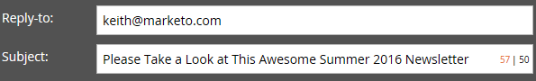

# メールヘッダーの編集 {#edit-your-email-header}

Marketo のメールヘッダーは完全にカスタマイズ可能です。これは、次の 4 つのフィールドで構成されます。

* **[!UICONTROL 送信者]** - 表示する送信者の名前
* **[!UICONTROL 送信者アドレス]** — 表示する送信者のメールアドレス
* **[!UICONTROL 返信先]** - 返信を送信するメールアドレス（[!UICONTROL 送信者]のアドレスとは異なる場合があります）
* **[!UICONTROL 件名]** — メールの件名行

これらの値を編集するには、各フィールドをクリックし、情報を入力します。

>[!TIP]
>
>デフォルトの送信者名とメールを設定するには、「[デフォルトのメール差出人と差出人ラベルの変更](/help/marketo/product-docs/administration/email-setup/change-the-default-from-email-and-from-label.md)」を参照してください。

トークンを使用する場合は、まず目的のフィールド内をクリックし、次にトークンアイコンをクリックします。

セグメントを使用して、フィールドを動的にすることもできます。

「[!UICONTROL 送信者アドレス]」フィールドの右端にあるキーアイコンを使用すると、カスタム DKIM 署名を使用しているかどうかを確認できます。

「[!UICONTROL 件名]」フィールドの右端にあるカウンターは、件名を推奨される 50 文字以下に保つのに役立ちます。

50 文字を超えると、カウンターが赤に変わり、警告が表示されます。

>[!MORELIKETHIS]
>
>[メールエディター v2.0 の概要](/help/marketo/product-docs/email-marketing/general/email-editor-2/email-editor-v2-0-overview.md)
