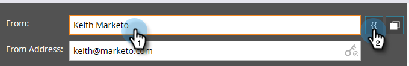

# 電子メールヘッダーの編集 {#edit-your-email-header}

Marketorの電子メールヘッダーは、完全にカスタマイズ可能です。 これは、次の4つのフィールドで構成されます。

* **送信者** — 表示する送信者の名前
* **送信者のアドレス** — 表示する送信者の電子メールアドレス
* **返信先** — 人の返信先の電子メールアドレス（「送信者のアドレス」とは異なる場合があります）
* **件名** — 電子メールの件名行

これらの値を編集するには、各フィールドをクリックし、情報を入力します。

>[!TIP]
>
>デフォルトの「名前から」と「電子メールから」を設定するには、「電子メールからデフォルトを [変更する」と「ラベルからデフォルトを変更する](/help/marketo/product-docs/administration/email-setup/change-the-default-from-email-and-from-label.md)」を参照してください。

トークンを使用する場合は、まず目的のフィールド内をクリックし、次にトークンアイコンをクリックします。

セグメントを使用して、フィールドを動的にすることもできます。

「送信者アドレス」フィールドの右端にあるキーアイコンを使用すると、カスタムDKIM署名を使用しているかどうかを確認できます。

[件名]フィールドの右端にあるカウンタは、件名を推奨される50文字以下に保つのに役立ちます。

50文字を超えると、カウンターが赤に変わり、警告が表示されます。

>[!MORELIKETHIS]
>
>* [電子メールエディタv2.0の概要](/help/marketo/product-docs/email-marketing/general/email-editor-2/email-editor-v2-0-overview.md)

