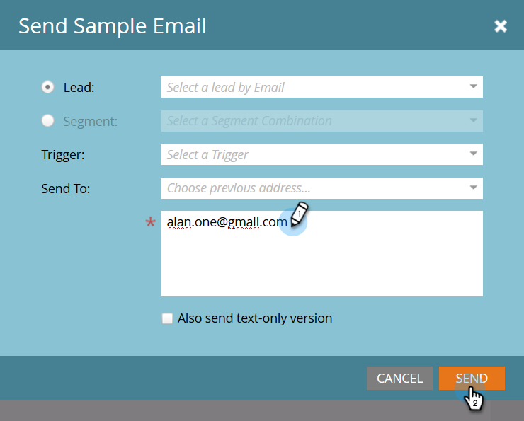
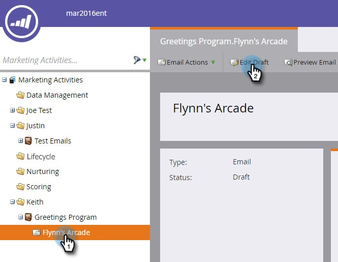
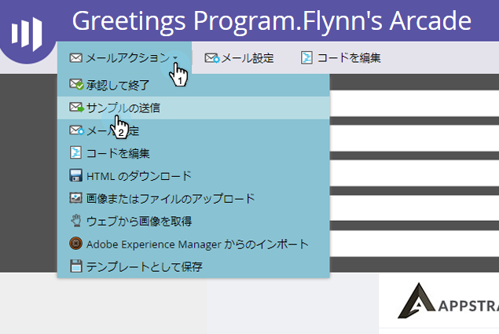
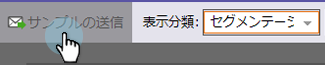

# サンプル電子メールの送信 {#send-a-sample-email}

電子メールのサンプルを簡単に送信できます。 動的なコンテンツの電子メールを送信するには、「動的なコンテンツを含む電子メールの [プレビュー](../../../../product-docs/email-marketing/general/functions-in-the-editor/preview-an-email-with-dynamic-content.md)」を参照してください。

>[!NOTE]
>
>サンプル電子メールを送信するには、 **Access Database - Run Single Flow Actions** 権限が必要です。

## サンプル電子メールの送信 {#send-a-sample-email-1}

1. 電子メールを探して選択します。 「 **電子メールアクション** 」ドロップダウンをクリックし、「サンプルを **送信**」を選択します。\
   

   >[!NOTE]
   >
   >マイトークンは、電子メールのプログラムに適した値に解決されます。

1. 配信の電子メールアドレスを入力し、「 **送信**」をクリックします。

   

   >[!NOTE]
   >
   >**Reminder**
   >
   >
   >複数の電子メールアドレスを入力する場合は、コンマで区切ります。

   >[!TIP]
   >
   >トークンを特定の担当者として解決する場合は、手順2の **担当者ドロップダウンでその** 担当者を選択します。

## 編集時のサンプル電子メールの送信 {#send-a-sample-email-while-editing}

1. 電子メールを探し、その電子メールを選択して、「 **ドラフトを** 編集」タブをクリックします。

   

1. 「 **電子メールアクション**」をクリックし、「サンプル **を送信**」を選択します。

   

1. 配信の電子メールアドレスを入力し、「 **送信**」をクリックします。

   

   >[!NOTE]
   >
   >トリガーフィールドは、 [電子メールスクリプティングを使用するユーザーにのみ適用でき](http://developers.marketo.com/documentation/velocity-script/)ます。

## セグメントに基づくサンプル電子メールの送信 {#send-a-sample-email-based-on-a-segment}

>[!PREREQUISITES]
>
>[電子メールにセグメントを適用します](http://docs.marketo.com/display/public/DOCS/Using+Dynamic+Content+in+an+Email)。

1. 電子メールを探し、その電子メールを選択して、「 **ドラフトを** 編集」タブをクリックします。

   

1. 「 **プレビュー**」をクリックします。

   

1. 「 **表示基準** 」ドロップダウンをクリックし、「 **セグメント化**」を選択します。

   

1. 使用可能なセグメントを含むドロップダウンが表示されます。 クリックし、目的のレポートを選択します。

   

1. 矢印を使用して、オプションをスクロールします（この場合は、件名行を動的に変更しました）。

   

1. 「サンプル **送信** 」をクリックして、実行中のセグメントのテスト電子メールを受信します。

   

   >[!TIP]
   >
   >セグメントに基づいたサンプルの電子メールを電子メールの編集モードで送信することもできます。 「 **電子メールアクション** 」ドロップダウンをクリックし、「サンプル **送信**」を選択して、セグメントを選択します。

キャンペーンを起動する前にコンテンツをサンプリングすることは非常に重要です。 2度、1回切れ！
