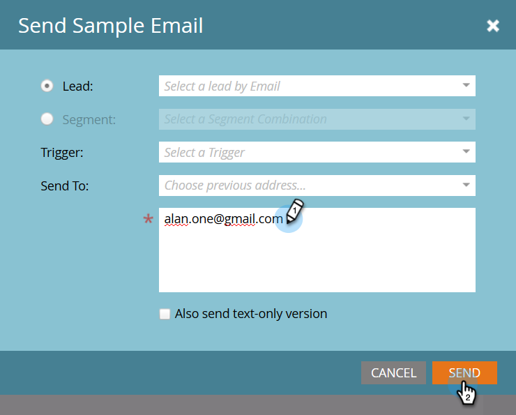
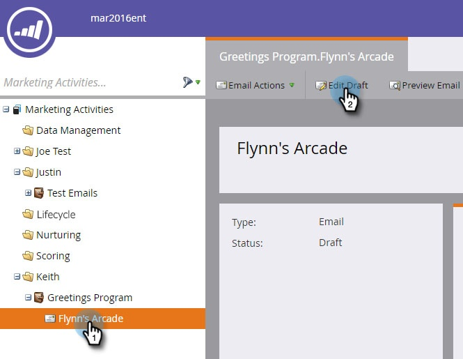
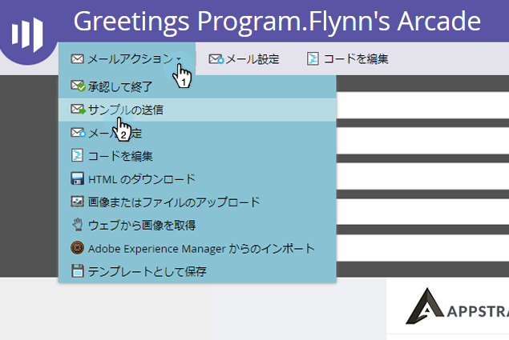
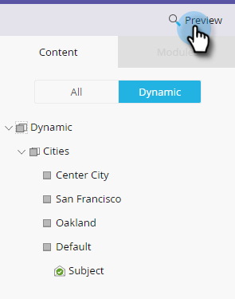
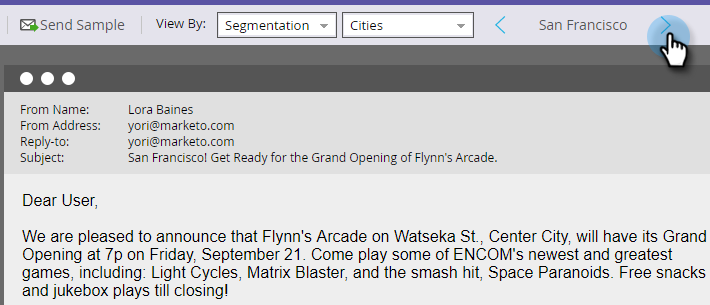
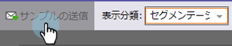

# サンプルメールの送信 {#send-a-sample-email}

メールのサンプルを送るのは迅速で簡単です。 動的コンテンツを含むメールを送信するには、「[動的コンテンツを使ったメールをプレビューする](/help/marketo/product-docs/email-marketing/general/functions-in-the-editor/preview-an-email-with-dynamic-content.md)」を参照してください。

>[!NOTE]
>
>サンプルメールの送信には、**データベースにアクセス - シングルフローアクションの実行**&#x200B;権限が必要です。

## サンプルメールの送信 {#send-a-sample-email-1}

1. メールを選択します。 **[!UICONTROL メールアクション]**&#x200B;ドロップダウンをクリックし、「**[!UICONTROL サンプルの送信]**」を選択します。
   

   >[!NOTE]
   >
   >マイトークンは、メールのプログラムに適した値に解決されます。

1. 配信するメールアドレスを 1 つ以上入力します。 複数のメールアドレスの場合は、コンマで区切ります。 終了したら「**[!UICONTROL 送信]**」をクリックします。

   

   >[!IMPORTANT]
   >
   >複数のメールアドレスを入力すると、すべての受信者に表示されます。 最初に入力した受信者がメイン受信者となり、その後に続くメールアドレスは CC 受信者となります。

   >[!TIP]
   >
   >トークンを特定のリードとして解決したい場合は、手順 2 の&#x200B;**人物ドロップダウン**&#x200B;メニューで値を選択します。

## 編集中にサンプルメールを送信する {#send-a-sample-email-while-editing}

1. メールを選択し、「**[!UICONTROL ドラフトの編集]**」をクリックします。

   

1. 「**[!UICONTROL メールアクション]**」をクリックして、「**[!UICONTROL サンプルの送信]**」を選択します。

   

1. 配信用のメールアドレスを入力して「**[!UICONTROL 送信]**」をクリックします。

   

   >[!NOTE]
   >
   >「トリガー」フィールドは、[メールスクリプティング](https://experienceleague.adobe.com/ja/docs/marketo-developer/marketo/email-scripting)を使用する場合にのみ適用できます。

## セグメントに基づくサンプルメールの送信 {#send-a-sample-email-based-on-a-segment}

>[!PREREQUISITES]
>
>[メールにセグメント化を適用します](/help/marketo/product-docs/email-marketing/general/functions-in-the-editor/using-dynamic-content-in-an-email.md)。

1. メールを選択し、「**[!UICONTROL ドラフトの編集]**」をクリックします。

   

1. 「**[!UICONTROL プレビュー]**」をクリックします。

   

1. **[!UICONTROL 閲覧方法]**&#x200B;ドロップダウンをクリックし、「**[!UICONTROL セグメント化]**」を選択します。

   

1. 使用可能なセグメント化を含むドロップダウンが表示されます。 それをクリックし、目的のものを選択します。

   

1. 矢印を使用して、オプションをスクロールします（この場合は、件名行を動的に変更します）。

   

1. 「**[!UICONTROL サンプルの送信]**」をクリックすると、実行中のセグメントのテスト用メールが届きます。

   

   >[!TIP]
   >
   >また、メールの編集モードでセグメントに基づいてサンプルメールを送信することもできます。 **[!UICONTROL メールアクション]**&#x200B;ドロップダウンをクリックし、「**[!UICONTROL サンプルの送信]**」を選択して、セグメントを選択します。

キャンペーンを開始する前にコンテンツのサンプルを確認することは非常に重要です。 実行に移す前に、念には念を入れましょう。
