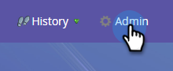
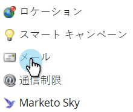
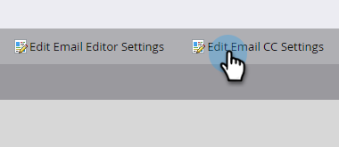
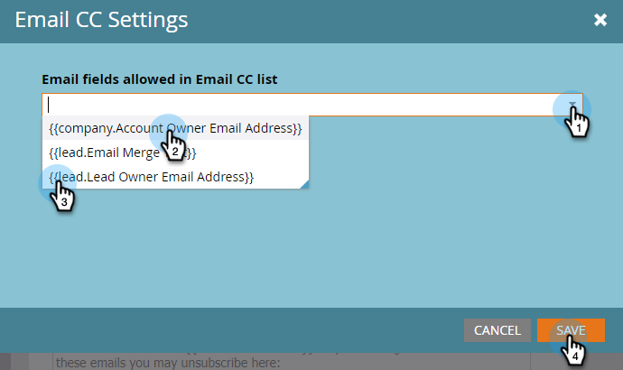
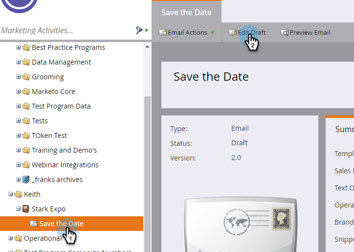
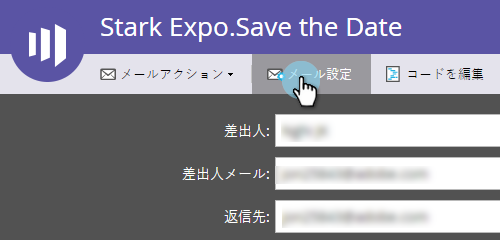
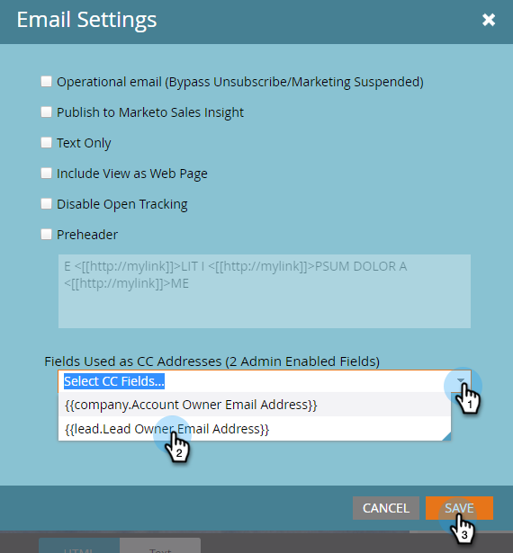
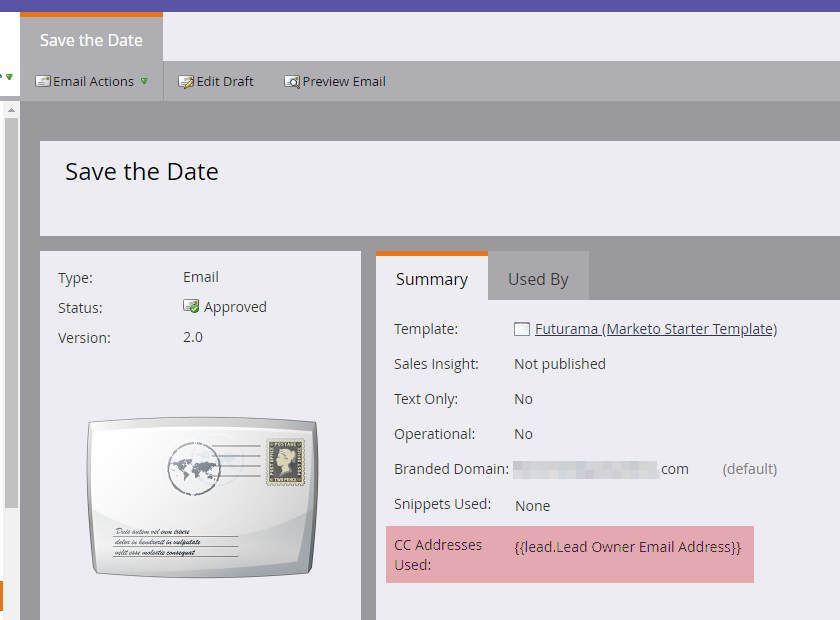
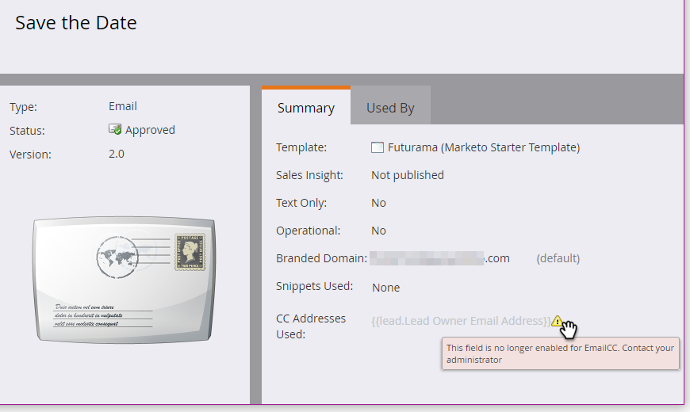

# メール CC {#email-cc}

メール CC を使用すると、Marketo を通じて送信される特定のメールに CC 受信者を含めることができます。

この機能は、メールの送信方法（バッチまたはトリガーキャンペーン）に関係なく、すべての Marketo メールアセットで使用できます。 CC の受信者は、選択された Marketo の人物に送信されたメールの正確なコピーを受け取ります。 エンゲージメントアクティビティ（開封数、クリック数など） メールの「宛先」行にMarketo ユーザーのアクティビティログが記録されます。 ただし、配信アクティビティ（送信、配信、ハードバウンスなど） 「ソフトバウンス」 _以外の_&#x200B;は、**not**&#x200B;登録します。これは、MarketoがMarketo ユーザーの配信イベントとCC受信者を区別できないためです。 Marketo で一度に CC できるのは最大 10 万人までです。 スマートリストが100kを超え、すべてのユーザーにCCを付与することが不可欠な場合は、リストを分割することをお勧めします。

>[!NOTE]
>
>メール CC は A/B テストで使用するようには設計されていません。 いずれにしても、必要に応じて使用できますが、技術的にサポートされていないため、Marketo サポートではトラブルシューティングを支援できません。

## メール CC の設定 {#set-up-email-cc}

1. マイ Marketo で、「**[!UICONTROL 管理]**」をクリックします。

   

1. ツリーで、「**[!UICONTROL メール]**」を選択します。

   

1. 「**[!UICONTROL メール CC 設定を編集]**」をクリックします。

   

1. 最大 25 個の Marketo リードまたは会社フィールド（「メール」タイプ）を選択して、メール内で CC アドレスとして使用できるようにします。 終了したら「**保存**」をクリックします。

   

## メール CC の使用 {#using-email-cc}

1. メールを選択して、「**[!UICONTROL ドラフトを編集]**」をクリックします。

   

1. 「**[!UICONTROL メール設定]**」をクリックします。

   

1. CC に使用するフィールドを選択します。 _メール 1 通につき 5 つまでの制限があります_。 この例では、リード所有者CCにのみ。 終了したら「**保存**」をクリックします。

   

   それくらい簡単です！ 上記の例では、メールを送信する際に、選択した受信者のリード所有者が CC されます。

   >[!NOTE]
   >
   >「CC」フィールドに無効なメールアドレスが入力されている場合は、そのメールアドレスはスキップされます。

   素早く識別できるように、メールの概要ビューには、どのメール CC フィールドが選択されているかが表示されます。

   

   メールが承認されたが、Marketo 管理者がメールの送信前に 1 つ以上の CC フィールドを無効にした場合、**これらのユーザーはメールを受信しません**。 このシナリオでは、メールの概要ビューで、承認後から送信前の間に無効にされたフィールドがグレー表示されます。

   

   >[!NOTE]
   >
   >また、上記のエラーは、メールのドラフトのメール設定セクションにも表示されます。

## 送信後 {#after-the-send}

* CC の受信者がメール内のトラッキングされたリンクをクリックすると、（他のすべてのエンゲージメントアクティビティと同様に）クリックアクティビティがメールのメイン受信者に関連付けられます。 また、クリックスルーして Marketo の web トラッキングコード（munchkin.js）を含むページに移動すると、メイン受信者として Cookie に紐付けられる場合があります。

>[!TIP]
>
>メールで[一部またはすべてのトラッキングリンクを無効にする](/help/marketo/product-docs/email-marketing/general/functions-in-the-editor/disable-tracking-for-an-email-link.md)オプションがあります。

* メールキャンペーンの実行後、「メールを送信」アクティビティには、メールの各受信者に含まれるすべての CC アドレスのリストが含まれます。 購読解除により CC アドレスがスキップされた場合は、その旨がアクティビティにも記録されます。
* 購読解除リンクと購読解除ページは、CC されたメールでも通常どおり機能します。 これにより、CC の受信者は、希望すれば（スパム対策規制に準拠して）問題なく購読解除でき、この操作の記録が Marketo データベースに保存されます。
* Marketo データベースで登録解除済みとしてリストされているユーザーは、CC 経由でメールを受信&#x200B;**しません**。
