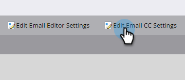

# 電子メールCC {#email-cc}

電子メールCCを使用すると、マーケティングを通じて指定した電子メールを送信し、CC受信者を含めることができます。

この機能は、電子メールの送信方法(バッチまたはトリガーキャンペーン)に関係なく、すべてのMarketor電子メールアセットで使用できます。 CC受信者は、選択したマーケティング担当者に送信された電子メールの正確なコピーを受け取ります。 そのため、エンゲージメントのアクティビティ（開く、クリックなど） は、電子メールの「宛先」行のマーケティング担当者のアクティビティログに記録されます。 ただし、配信アクティビティ（送信、配信、ハードバウンスなど） *「ソフトバウンス」以外は* 、マーケティング担当者の配信イベントとCC受信者のを区別できないので **** 、登録されません。 Marketorは、一度に最大100,000人のユーザーのみをCCします。 スマートリストが100kを超え、その上のすべての人がCCを受けることが不可欠な場合は、リストを無効にすることをお勧めします。

>[!NOTE]
>
>電子メールCCは、A/Bテストで使用するように設計されていません。 技術的にはサポートされていないので、Marketo Supportがトラブルシューティングを支援できない場合は、どのような場合でも使用できます。

## 電子メールCCの設定 {#set-up-email-cc}

1. 「マーケティング」で、「 **管理者**」をクリックします。

   

1. ツリーで、「 **Email**」を選択します。

   

1. 「電子メールCC設定を **編集**」をクリックします。

   

1. 最大25個の「マーケティング担当者リード」フィールドまたは「会社」フィールド（タイプ「電子メール」）を選択し、電子メール内でCCアドレスとして使用できるようにします。 終了したら **「保存** 」をクリックします。

   

## 電子メールCCの使用 {#using-email-cc}

1. 電子メールを選択し、「 **ドラフトを編集**」をクリックします。

   

1. 「 **電子メールの設定**」をクリックします。

   

1. CCユーザーに使用するフィールドを5つまで選択します。 この例では、リード所有者CCのみが必要です。終了したら **「保存** 」をクリックします。

   

   そんな簡単なこと！ 上記の例では、電子メールを送信する際、選択した受信者のリード所有者はCCになります。

   >[!NOTE]
   >
   >
   >CCフィールドに無効な電子メールアドレスが含まれている場合、その電子メールアドレスはスキップされます。

   識別を簡単に行うために、電子メールの概要表示に、電子メールCCフィールドが選択されたかどうかを示します。  

   電子メールが承認されたが、マーケティング担当者が電子メールの送信前に1つ以上のCCフィールドを無効にした場合、そ **のユーザーは電子メールを受信しません**。 このシナリオでは、電子メールの概要表示は、承認後に無効になっていて、事前に送信されていたフィールドを灰色表示にします。

   

   >[!NOTE]
   >
   >また、電子メールのドラフトの「電子メール設定」セクションにも上記のエラーが表示されます。

## 送信後 {#after-the-send}

* CC受信者が電子メール内の追跡対象リンクをクリックした場合、クリックアクティビティ(他のすべてのエンゲージメントアクティビティと同様)が電子メールのメイン受信者に関連付けられます。 さらに、クリックスルーしてマーケティング担当者のWebトラッキングコード(munchkin.js)を含むページに移動した場合、それらのコードがメイン受信者としてcookieで送信されます。

>[!TIP]
>
>電子メール内の一部またはすべてのトラッキングリンクを [無効にするオプションがあり](http://docs.marketo.com/x/IwAd) 、

* 電子メールキャンペーンの実行後、「電子メールの送信」アクティビティには、電子メールの各受信者に含まれていたすべてのCCアドレスのリストが含まれます。 登録解除によってCCアドレスがスキップされた場合は、アクティビティにもそのCCアドレスが記録されます。
* 購読解除リンクとページは、通常、CCd電子メールで機能します。 これにより、CC受信者は希望に応じて（スパム対策規制に従って）登録を取り消すことができ、この行動の記録がMarketo Databaseに保存されます。
* Marketing Databaseに登録解除と表示されたユーザーは、CC経由で電子メールを受信 **しません** 。

