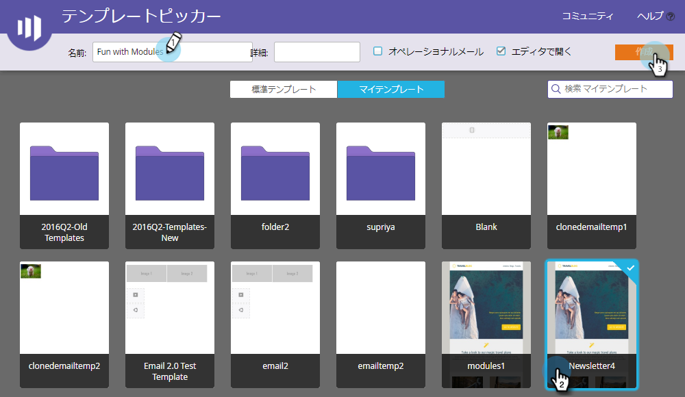
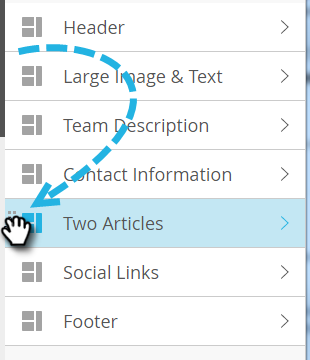

# 電子メール追加へのモジュール{#add-modules-to-your-email}

電子メールエディタ2.0では、モジュールは、テンプレートで定義された電子メールのセクションです。 モジュールには、要素、変数、その他のHTMLコンテンツの任意の組み合わせを含めることができます。 メールに簡単に追加できます。

1. 電子メールを作成します。 必ず、モジュールを含むテンプレートを選択（または作成）してください。

   

   >[!NOTE]
   >
   >ほとんどのマーケティング担当者スターターテンプレートには、モジュールが含まれています。 [独自の](http://docs.marketo.com/display/DOCS/Email+Template+Syntax#EmailTemplateSyntax-Modules)を作成することもできます。

1. 電子メールの右端にある「**モジュール**」をクリックします。

   

1. 追加するモジュールを選択し、電子メールにドラッグします。

   

1. モジュールを上にドラッグすると、他のモジュール間に「ここにドロップ」が表示されます。 新しいモジュールを希望の場所にドロップします。

   

1. 数秒待つと、電子メールが自動更新され、追加したモジュールが表示されます。

   

## 電子メール内でのモジュールの移動{#moving-a-module-within-an-email}

モジュールを移動する方法は2つあります。

1. 移動するモジュールを特定します。 名前がわからない場合は、その上にマウスポインターを置くと、右側にハイライト表示されます。

   

1. 右側のモジュールの上にカーソルを置くと、ハンドルが表示されます。 つかんで…

   

1. ...モジュールを目的の場所にドラッグします。

   

1. もう1つの方法は、電子メール内のモジュールをクリックして選択し、ギアアイコンを表示することです。

   

1. 歯車アイコンをクリックし、モジュールの移動先に応じて、「**上へ移動**」または「**下へ移動**」を選択します。

   

それだけだ。

>[!MORELIKETHIS]
>
>[電子メールテンプレートの構文](email-template-syntax.md)

