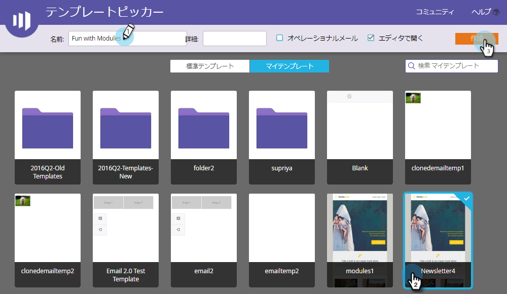
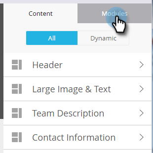
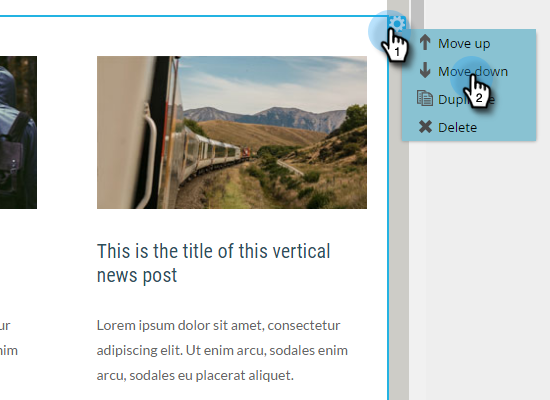

# メールにモジュールを追加する {#add-modules-to-your-email}

[!DNL Email Editor 2.0] のモジュールは、テンプレートで定義されたメールのセクションです。 モジュールには、要素、変数、その他の HTML コンテンツの任意の組み合わせを含めることができます。 メールには簡単に追加できます。

1. メールを作成します。 必ず、モジュールを含むテンプレートを選択（または作成）してください。

   

   >[!NOTE]
   >
   >ほとんどの Marketo [!UICONTROL スターターテンプレート]には[!UICONTROL モジュール]が含まれています。 また、[独自のものを作成](/help/marketo/product-docs/email-marketing/general/email-editor-2/email-template-syntax.md#modules)することもできます。

1. メールの右端にある「**[!UICONTROL モジュール]**」をクリックします。

   

1. 追加するモジュールを選択し、メールにドラッグします。

   

1. モジュールをドラッグすると、他のモジュールの間に「ここにドロップ」が表示されます。 新しいモジュールを希望する場所にドロップします。

   

1. 数秒待つと、メールが自動更新され、追加したモジュールが表示されます。

   

## メール内でのモジュールの移動 {#moving-a-module-within-an-email}

モジュールを移動する方法は 2 つあります。

1. 移動するモジュールを特定します。 それが何と呼ばれるかわからない場合は、その上にカーソルを合わせると、右側に強調表示されます。

   

1. 右側のモジュールにマウスポインタを合わせると、ハンドルが表示されます。 モジュールをつかんで...

   

1. ...目的の場所にドラッグします。

   

1. もう 1 つの方法は、メール内のモジュールをクリックして選択することです。歯車アイコンが表示されます。

   

1. 歯車アイコンをクリックし、モジュールの移動先に応じて、「**[!UICONTROL 上に移動]**」または「**[!UICONTROL 下に移動]**」を選択します。

   

以上です。

>[!MORELIKETHIS]
>
>[メールテンプレートの構文](/help/marketo/product-docs/email-marketing/general/email-editor-2/email-template-syntax.md)
