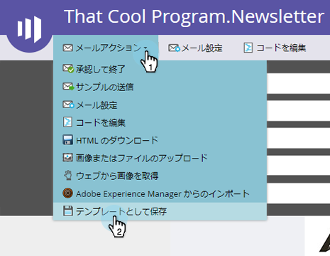

# メールテンプレートを作成する {#create-an-email-template}

新しいメールテンプレートを作成する手順は、以下のとおりです。

>[!NOTE]
>
>Marketo サポートは、カスタム HTML のトラブルシューティングについては対応できません。HTML のサポートについては、Web 開発者にご相談ください。

## メールテンプレートを新規作成する {#create-a-new-email-template}

1. 「**Design Studio**」をクリックします。

   

1. 「**新規作成**」をクリックして、「**新規メールテンプレート**」を選択します。

   

1. 新しいテンプレートに名前を付け、「**作成**」をクリックします。

   

1. 新しいテンプレートの編集を開始するには、「**ドラフトの編集**」をクリックします。

   

   >[!CAUTION]
   >
   >ハードリミットはありませんが、500 を超えるメールでメールテンプレートが使用された場合、アップデート後にそのテンプレートを再承認するとパフォーマンスの問題が生じる可能性があります。メールテンプレートに 500 のメールが関連付けられたら、新しいテンプレートを作成することをお勧めします。

## メールをテンプレートとして保存する {#save-an-email-as-a-template}

作成したメールを後で使用するためにテンプレートとして保存する場合は、次の簡単な手順に従います。

1. 「**マーケティングアクティビティ**」をクリックします。

   

1. メールを選択し、「**ドラフトの編集**」をクリックします。

   

1. **メールアクション**&#x200B;ドロップダウンをクリックし、「**テンプレートとして保存**」を選択します。

   

1. **フォルダー**&#x200B;ドロップダウンをクリックし、テンプレートを保存する場所を選択して、「**保存**」をクリックします。

   

   これで手順は完了です。

   >[!CAUTION]
   >
   >メールをテンプレートとして保存する場合、変数の値は持ち越されません。変数は、基になるテンプレートで指定されたデフォルトを引き続き使用します。メール内の使用可能なモジュールも、メール本文に挿入されていない限り持ち越されません。

メールテンプレートをカスタマイズするには、以下の記事を参照してください。

>[!MORELIKETHIS]
>
>[メールテンプレートの構文](/help/marketo/product-docs/email-marketing/general/email-editor-2/email-template-syntax.md)>
>
