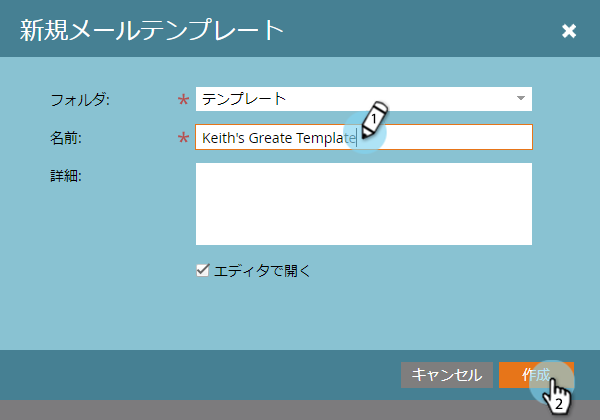

# メールテンプレートを作成する {#create-an-email-template}

新しいメールテンプレートを作成する手順は、以下のとおりです。

>[!NOTE]
>
>Marketo サポートは、カスタム HTML のトラブルシューティングについては対応できません。HTML のサポートについては、web 開発者にご相談ください。

>[!CAUTION]
>
>使用するエディターでは、color および background-color の CSS プロパティ値が小文字に変換されるので、キャメルケースを使用せず、代わりに小文字の名前やハイフンを使用してください。

## メールテンプレートを新規作成する {#create-a-new-email-template}

1. 「**[!UICONTROL Design Studio]**」をクリックします。

   

1. 「**[!UICONTROL 新規作成]**」をクリックして、「**[!UICONTROL 新規メールテンプレート]**」を選択します。

   

1. 新しいテンプレートに名前を付け、「**[!UICONTROL 作成]**」をクリックします。

   

1. 新しいテンプレートの編集を開始するには、「**[!UICONTROL ドラフトの編集]**」をクリックします。

   

   >[!CAUTION]
   >
   >ハードリミットはありませんが、500 を超えるメールでメールテンプレートが使用された場合、アップデート後にそのテンプレートを再承認するとパフォーマンスの問題が生じる可能性があります。メールテンプレートに 500 のメールが関連付けられたら、新しいテンプレートを作成することをお勧めします。

## メールをテンプレートとして保存する {#save-an-email-as-a-template}

作成したメールを後で使用するためにテンプレートとして保存する場合は、次の簡単な手順に従います。

1. 「**[!UICONTROL マーケティングアクティビティ]**」をクリックします。

   

1. メールを選択し、「**[!UICONTROL ドラフトの編集]**」をクリックします。

   

1. **[!UICONTROL メールアクション]**&#x200B;ドロップダウンをクリックし、「**[!UICONTROL テンプレートとして保存]**」を選択します。

   

1. **[!UICONTROL フォルダー]**&#x200B;ドロップダウンをクリックし、テンプレートを保存する場所を選択して、「**[!UICONTROL 保存]**」をクリックします。

   

   これで手順は完了です。

   >[!CAUTION]
   >
   >メールをテンプレートとして保存する場合、変数の値は持ち越されません。変数は、基になるテンプレートで指定されたデフォルトを引き続き使用します。メール内の使用可能なモジュールも、メール本文に挿入されていない限り持ち越されません。

メールテンプレートをカスタマイズするには、以下の記事を参照してください。

>[!MORELIKETHIS]
>
>[メールテンプレートの構文](/help/marketo/product-docs/email-marketing/general/email-editor-2/email-template-syntax.md)
