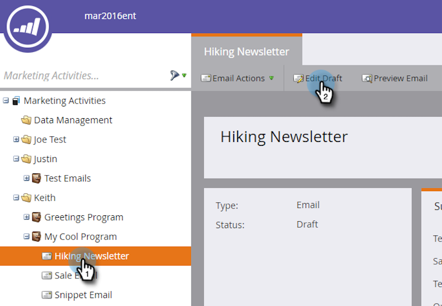
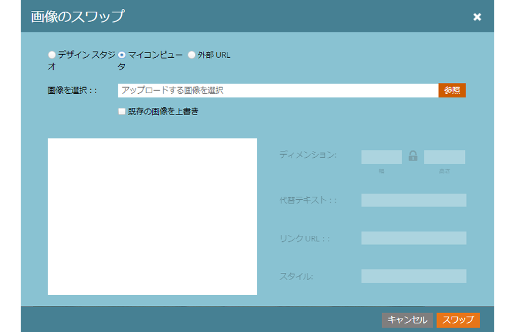
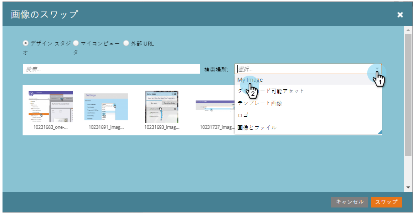
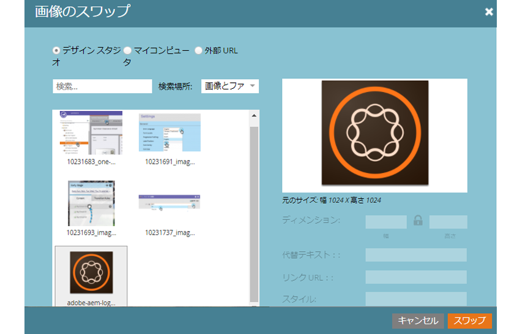

# 電子メール内の要素の編集 {#edit-elements-in-an-email}

電子メールには、次の4つの異なる要素を含めることができます。リッチテキスト、画像、スニペット、ビデオ。 それぞれの編集方法を次に示します。

## リッチテキスト要素の編集方法 {#how-to-edit-the-rich-text-element}

1. 電子メールを探し、その電子メールを選択して、「 **ドラフトを編集**」をクリックします。

   

1. 電子メールエディターが開きます。 リッチテキストを選択し、歯車アイコンをクリックして「 **編集**」を選択します。

   

   右側のパネルの要素の上にマウスポインターを置くと、歯車アイコンが表示されます。

   

1. 追加/テキストを編集し、「 **保存**」を押します。

   

   >[!NOTE]
   >
   >**Reminder**
   >
   >
   >また、画像、トークン、表、その他の要素を追加することもできます。 「リッチテキストエディタ [の使用](../../../../product-docs/email-marketing/general/understanding-the-email-editor/using-the-rich-text-editor.md)」を参照してください。

   >[!CAUTION]
   >
   >WebサイトやWordドキュメントなどのリッチテキストソースからテキストをコピーして貼り付けるのは避けてください。 代わりに、リッチテキストをまずメモ帳(Windows)やTextEdit(Mac)などのプレーンテキストエディターに貼り付けます。 「クリーン」になったら、プレーンテキストエディターからコピーして、電子メールに貼り付けることができます。

## 画像要素の編集方法 {#how-to-edit-the-image-element}

1. 画像要素を含むモジュール内をクリックして選択します。

   

1. 編集する画像要素をクリックし、歯車アイコンをクリックして「 **編集**」を選択します。

   

   >[!NOTE]
   >
   >要素を重複クリックして編集を開始することもできます。

1. 画像エディタが表示されます。

   

   画像を挿入する方法は3つあります。 それぞれを見てみよう。

   **外部URL**

   >[!NOTE]
   >
   >マーケティングトークンを使用する場合は、このオプションを使用します。 トークンを使用すると、プレビューはエディターで壊れて表示されますが、画像はエディターモードでレンダリングされ、サンプルを送信電子メールで表示されます。

   **入れ替え** 

   **マイコンピュータ**

   コンピューターから画像をアップロードするには、「 **参照**」をクリックします。

   

   コンピューター上の画像の場所に移動し、挿入します。

   

   必要に応じて寸法を変更し、代替テキスト（オプション）を変更して、 **Swap**&#x200B;キーを押します。

   

   >[!NOTE]
   >
   >画像を置き換える場合は、「画像URL/名前」の下に表示される「既存の画像を **上書き** 」ボックスをオンにする必要があります。

   **Design** StudioDesign Studioからイメージを挿入するには、イメージを見つけるだけです。

   

   **入れ替え**
   

外部URLを使用するには、まず画像のURLに貼り付けます。 必要に応じて寸法を変更し、代替テキストをいくつか追加します（オプション）。 次にを押します。              ...挿入します。 必要に応じて寸法を変更し、代替テキスト（オプション）を変更して、を押します。

## スニペット要素の編集方法 {#how-to-edit-the-snippet-element}

1. スニペット要素を含むモジュール内をクリックします。

   

1. スニペット要素をクリックし、歯車アイコンをクリックして「 **編集**」を選択します。

   

1. スニペットを探して選択し、「 **保存**」をクリックします。

   

1. スニペットが設定されます。

   

## ビデオ要素の編集方法 {#how-to-edit-the-video-element}

1. ビデオ要素を含むモジュール内をクリックします。

   

1. ビデオ要素をクリックし、歯車アイコンをクリックして、「 **編集**」を選択します。

   

1. VimeoまたはYouTubeからビデオURLに貼り付けます。 次に、プレビューが読み込むURLボックスの外をクリックします。 必要に応じて寸法を変更し、代替テキスト（オプション）を追加して、 **挿入**(Insert)を押します。

   

   >[!NOTE]
   >
   >YouTubeビデオの場合は、「共有」オプションのショートカットURLではなく、アドレスバーの完全修飾URLを使用します。

完璧なメールをデザインして楽しんで！
