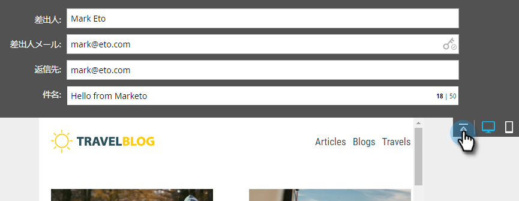
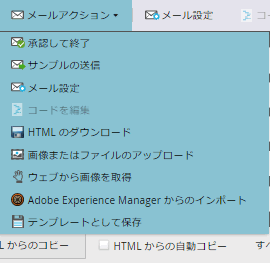

# 電子メールエディタv2.0の概要 {#email-editor-v-overview}

電子メールエディタv2.0をアクティブにすると、いくつかの新機能が追加されました。

**電子メールテンプレート選択**

新しい電子メールを作成すると、 [電子メールテンプレートピッカーに移動します](email-template-picker-overview.md)。

**電子メールエディタ**

電子メールの編集開始を見ると、エディターの外観が全く新しくなっているのがわかります。

**モジュール**

エディターの右側にあるものをモジュールと呼びます。 電子メールにモジュールを [追加する方法を説明します](add-modules-to-your-email.md)。

**テキストバージョン**

電子メールのHTMLバージョンとテキストバージョンを切り替えると、下部の便利なタブになりました。 電子メールのテキストバージョンを [編集する方法を説明します](../../../../product-docs/email-marketing/general/creating-an-email/edit-the-text-version-of-an-email.md)。

**電子メールヘッダー**

デザインスペースを増やしますか？ 電子メールヘッダーは、 [編集が完了した後で非表示にすることができます](../../../../product-docs/email-marketing/general/creating-an-email/edit-your-email-header.md)。 このアイコンをクリックするだけです。

...ヘッダーが折りたたまれます。

**電子メールのプレビュー**

デフォルトでは、電子メールはデスクトップ上での見え方を表示し、青色のアイコンで示されます。 右側のアイコンをクリックすると、

...モバイルデバイスでの電子メールのレンダリング方法を確認できます。

プレビューを大きくするには、電子メールの右上にある **プレビュー** をクリックします。

デフォルトの表示はデスクトップです…

...しかし、モバイルデバイス上での見え方もわかります。 テキスト版もプレビューできます！ 右上の「 **ドラフトを編集** 」をクリックするだけで、編集を再開できます。

**電子メールアクション**

「 **電子メールアクション**」に新機能が加わりました。 **画像またはファイルのアップロード**、Webから **画像を**&#x200B;グラブ。 電子メール自体を新しい電子メールテンプレートとして保存することもできます。 名前と行き先を与えさえすればよい。

>[!CAUTION]
>
>電子メールをテンプレートとして保存する場合、変数の値は持ち越されません。 変数は、基になるテンプレートで指定されたデフォルトを引き続き使用します。 電子メール内の使用可能なモジュールも、電子メールの本文に挿入されない限り持ち越されません。

>[!NOTE]
>
>** Grab Images from Web **は、Design Studioと同様に機能します。

**「** 電子メール設定 **」の下の「未完了の追跡**」を無効にすると、必要に応じて未完了の追跡を無効にできます。

**電子メールの設定**

プリヘッダーを追加するオプションがあります。 「プリヘッダー」は、受信トレイで電子メールが表示されたときの件名行の後の短い概要テキストです。

>[!CAUTION]
>
>電子メールエディターの使用時に、プリヘッダーでトークンが機能しません。 プリヘッダーでトークンを使用するには、電子メールテンプレート内の独自のHTMLを使用する必要があります。

素晴らしい新機能が多数追加されました。 楽しんで！

>[!NOTE]
>
>**ディープダイブ**
>
>さらに深く掘り下げたい場合は、この [役立つビデオをご覧ください](https://nation.marketo.com/videos/1463)。

>[!NOTE]
>
>**関連記事**
>
>* [電子メールテンプレートの構文](email-template-syntax.md)

>

