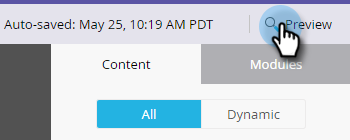

# メールエディター v2.0 の概要 {#email-editor-v2-overview}

Email Editor v2.0 を有効化すると、いくつかの新機能に気づかれるでしょう。

**メールテンプレート選択ツール**

新しいメールを作成すると、[メールテンプレート選択ツール](/help/marketo/product-docs/email-marketing/general/email-editor-2/email-template-picker-overview.md)に移動します。

**メールエディター**

メールの編集を開始すると、エディターの外観がまったく新しくなっているのがわかります。

**モジュール**

エディターの右側にあるものは、モジュールと呼ばれます。[メールにモジュールを追加](/help/marketo/product-docs/email-marketing/general/email-editor-2/add-modules-to-your-email.md)する方法を説明します。

**テキストバージョン**

メールの HTML バージョンとテキストバージョンの切り替えは、下部の便利なタブに表示されます。[テキストバージョンのメールを編集](/help/marketo/product-docs/email-marketing/general/creating-an-email/edit-the-text-version-of-an-email.md)する方法を説明します。

**メールヘッダー**

デザインスペースがもっと必要な場合、[編集](/help/marketo/product-docs/email-marketing/general/creating-an-email/edit-your-email-header.md)が完了したら、メールヘッダーを非表示にできます。このアイコンをクリックするだけです...

...ヘッダーが折りたたまれます。

**メールをプレビューする**

デフォルトでは、メールにはデスクトップ（ハイライトされた青いアイコン）で表示される状態が示されます。その右にあるアイコンをクリックすると...

...モバイルデバイスでのメールのレンダリング状態が表示されます。

大きいプレビューを表示するには、メールの右上にある「**プレビュー**」をクリックします。

デフォルトのビューはデスクトップですが...

...モバイルデバイスでの表示を確認することもできます。テキストバージョンのプレビューも確認できます。右上の「**ドラフトの編集**」をクリックするだけで、編集を再開できます。

**メールアクション**

「**メールアクション**」にも、新しい機能があります。「**画像またはファイルのアップロード**」と「**Web から画像を取得**」です。メール自体を新しいメールテンプレートとして保存することもできます。名前と説明を指定するだけです。

>[!CAUTION]
>
>メールをテンプレートとして保存する場合、変数の値は持ち越されません。変数は、基になるテンプレートで指定されたデフォルトを引き続き使用します。メール内で使用可能なモジュールも、メール本文に挿入されない限り持ち越されません。

>[!NOTE]
>
>「**[Web から画像を取得](/help/marketo/product-docs/demand-generation/images-and-files/grab-the-images-from-a-web-page.md)**」は、Design Studio の場合と同じように動作します。

「**メール設定**」の「**オープントラッキングを無効にする**」で、必要に応じてオープントラッキングを無効にできます。

**メール設定**

プレヘッダーを追加するオプションがあります。プレヘッダーとは、受信トレイでメールを表示する際、件名の後に表示される短い概要です。

>[!CAUTION]
>
>メールエディターを使用している際には、トークンはプリヘッダーで機能しません。プリヘッダーでトークンを使用するには、メールテンプレートで独自の HTML を使用する必要があります。

ほかにも、新しい機能がたくさんあります。お楽しみください。

>[!NOTE]
>
>詳しくは、この[ビデオ](https://nation.marketo.com/videos/1463)を参照してください。

>[!MORELIKETHIS]
>
>[メールテンプレートの構文](/help/marketo/product-docs/email-marketing/general/email-editor-2/email-template-syntax.md)
