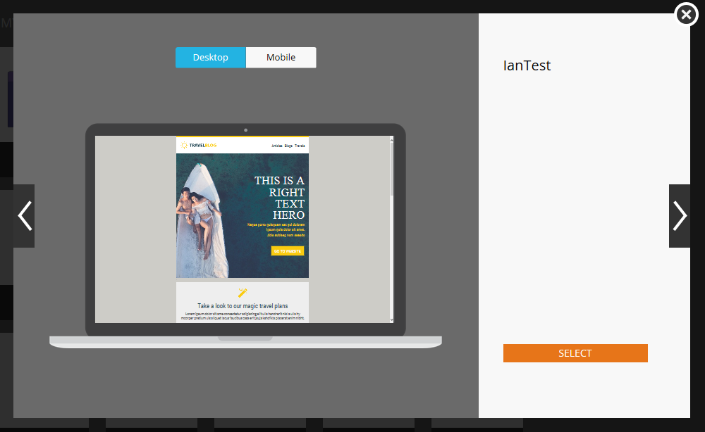
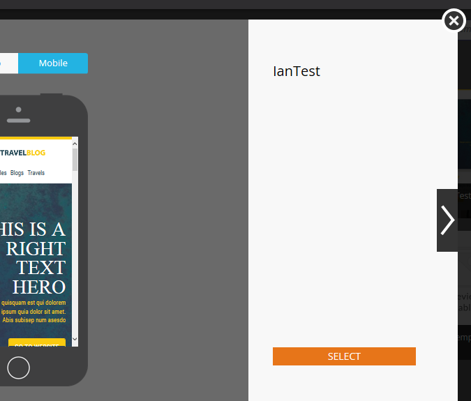
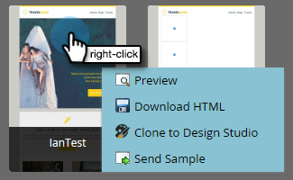

# メールテンプレート選択ツールの概要 {#email-template-picker-overview}

[メールの作成時](/help/marketo/product-docs/email-marketing/general/creating-an-email/create-an-email.md)に選択できる無料テンプレートはいくつかあります。 独自のテンプレートを作成し、後で使用するために保存することもできます。

**[!UICONTROL 名前]**&#x200B;は、テンプレート自体ではなく、テンプレートに基づいて作成するメールの名前です。 **[!UICONTROL 説明]**&#x200B;はメールにも適用され、オプションです。

メールが重要で、通信制限を回避したい場合、「[オペレーショナルにする](/help/marketo/product-docs/email-marketing/general/functions-in-the-editor/make-an-email-operational.md)」をオンにします。 「**[!UICONTROL エディターで開く]**」はデフォルトで選択されており、単に新しいメールの編集をすぐに開始したいという意味です。 「**[!UICONTROL 作成]**」は文字通りです。

「**[!UICONTROL スターターテンプレート]**」には、すぐに使えるレスポンシブメールテンプレートのコレクションが含まれています。 そのまま使用することも、好みに合わせてカスタマイズすることもできます。

**[!UICONTROL マイテンプレート]**&#x200B;は、作成したすべてのテンプレートで構成されます。 また、フォルダーを持つこともできます。

[!UICONTROL デザインスタジオ]ツリーの&#x200B;**[!UICONTROL メール]**／**[!UICONTROL テンプレート]**&#x200B;に表示されるすべてのフォルダーは、**[!UICONTROL マイテンプレート]**&#x200B;で使用できます。

テンプレートをプレビューするには、そのサムネールにマウスポインタを合わせて、「**[!UICONTROL プレビュー]**」をクリックします。 ダブルクリックすることもできます。

プレビューアは、デスクトップマシン上...

...とモバイルデバイスでのテンプレートのレンダリング方法を示します。

このテンプレートが気に入ったら、右下の「**[!UICONTROL 選択]**」をクリックしてテンプレートを選択してください。 他のテンプレートを探したい場合は、 右上の「**X**」をクリックします。 いろいろなテンプレートをスクロールするには、左右の矢印を使用します。

テンプレートのサムネールを右クリックして、その他のオプションを表示することもできます。

>[!NOTE]
>
>テンプレートのサムネールの素晴らしい点は、それらはライブであるということです。 テンプレートに変更を加えると、サムネールも一緒に変更されます。

すてきですね。

>[!MORELIKETHIS]
>
>* [メールテンプレートの構文](/help/marketo/product-docs/email-marketing/general/email-editor-2/email-template-syntax.md)
>* [メールの作成](/help/marketo/product-docs/email-marketing/general/creating-an-email/create-an-email.md)
