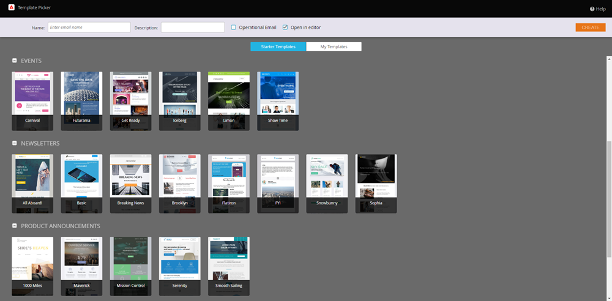
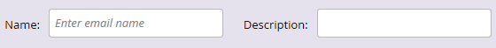
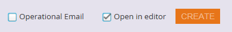
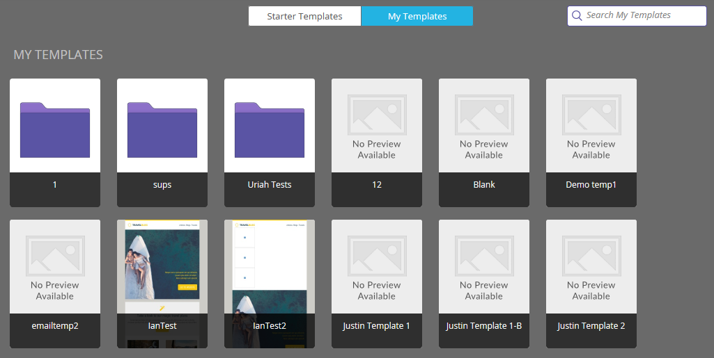
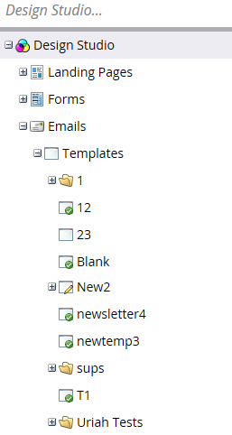
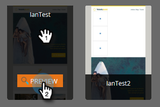
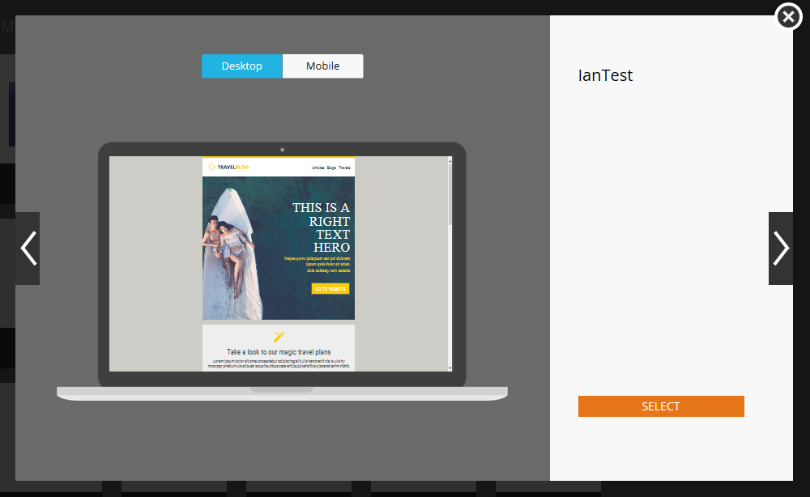
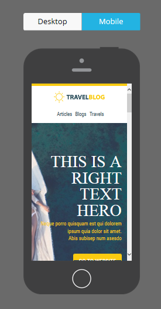
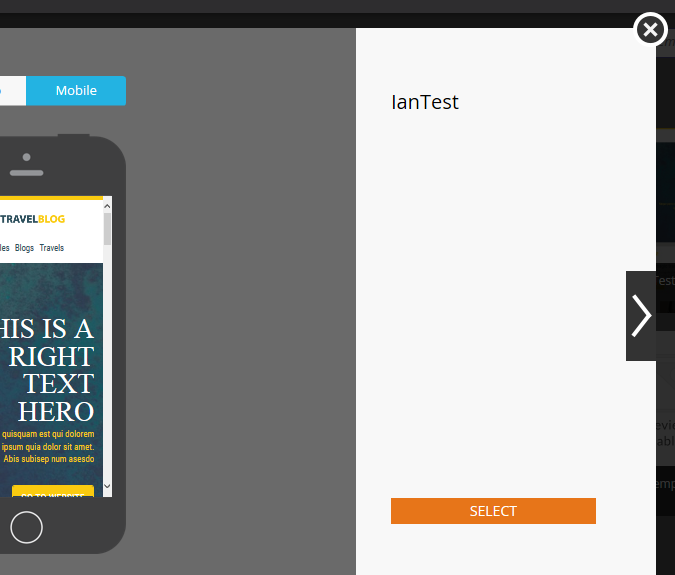
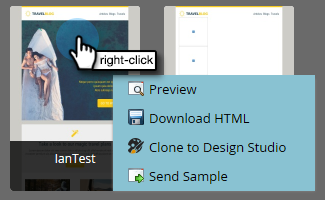

# メールテンプレート選択ツールの概要 {#email-template-picker-overview}

[メールの作成時](/help/marketo/product-docs/email-marketing/general/creating-an-email/create-an-email.md)に選択できる無料テンプレートはいくつかあります。 独自のテンプレートを作成し、後で使用するために保存することもできます。

**[!UICONTROL 名前]**&#x200B;は、テンプレート自体ではなく、テンプレートに基づいて作成するメールの名前です。 **[!UICONTROL 説明]**&#x200B;はメールにも適用され、オプションです。

メールが重要で、通信制限を回避したい場合、「[オペレーショナルにする](/help/marketo/product-docs/email-marketing/general/functions-in-the-editor/make-an-email-operational.md)」をオンにします。 「**[!UICONTROL エディターで開く]**」はデフォルトで選択されており、単に新しいメールの編集をすぐに開始したいという意味です。 「**[!UICONTROL 作成]**」は文字通りです。

「**[!UICONTROL スターターテンプレート]**」には、すぐに使えるレスポンシブメールテンプレートのコレクションが含まれています。 そのまま使用することも、好みに合わせてカスタマイズすることもできます。

**[!UICONTROL マイテンプレート]**&#x200B;は、作成したすべてのテンプレートで構成されます。 また、フォルダーを持つこともできます。

[!UICONTROL デザインスタジオ]ツリーの&#x200B;**[!UICONTROL メール]**／**[!UICONTROL テンプレート]**&#x200B;に表示されるすべてのフォルダーは、**[!UICONTROL マイテンプレート]**&#x200B;で使用できます。

テンプレートをプレビューするには、そのサムネールにマウスポインタを合わせて、「**[!UICONTROL プレビュー]**」をクリックします。 ダブルクリックすることもできます。

プレビュー画面では、テンプレートがデスクトップマシン上でどのようにレンダリングされるかを表示します。

...とモバイルデバイスでのテンプレートのレンダリング方法を示します。

このテンプレートが気に入ったら、右下の「**[!UICONTROL 選択]**」をクリックしてテンプレートを選択してください。 他のテンプレートを探したい場合は、 右上の「**X**」をクリックします。 いろいろなテンプレートをスクロールするには、左右の矢印を使用します。

テンプレートのサムネイルを右クリックして、その他のオプションを表示することもできます。

>[!NOTE]
>
>テンプレートのサムネールの素晴らしい点は、それらはライブであるということです。 テンプレートに変更を加えると、サムネイルも一緒に変更されます。

すてきですね。

>[!MORELIKETHIS]
>
>* [メールテンプレートの構文](/help/marketo/product-docs/email-marketing/general/email-editor-2/email-template-syntax.md)
>* [メールの作成](/help/marketo/product-docs/email-marketing/general/creating-an-email/create-an-email.md)
