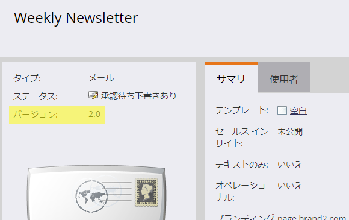

# Eメールエディター2.0への移行 {#transitioning-to-email-editor}

2019年6月のリリースで、すべてのMarketoサブスクリプションがEメールエディター2.0に移行されました。[Eメールエディター1.0のサポート終了の詳細](https://nation.marketo.com/docs/DOC-7038)

サブスクリプション内のEメールとEメールテンプレートには、バージョン番号が必要です。 アセットの概要ページにバージョンが表示されます。

デフォルトでは、既存の電子メールおよび電子メールテンプレートは、Spring &#39;16リリースより前か、電子メールエディター2.0が無効になっているリリース後に作成された場合、すべてv1.0としてマークされます。 Eメールエディター2.0が自動的に有効になった場合、次の動作が表示されます。

* 新しい電子メールを作成すると、[電子メールテンプレートピッカー](email-template-picker-overview.md)が表示され、v2.0電子メールテンプレートを選択できます。
* Eメールエディター2.0でEメールを作成または編集する際、結果のEメールは常にv2.0としてマークされます（v1.0のEメールテンプレートを使用している場合でも）。****

Eメールエディター2.0に移行する前に、サブスクリプションにv1.0のEメールが含まれている場合、アセットの現在の状態に基づいて、次の動作が発生します。

**承認済み**  - 「ドラフトを編集」をクリックすると、承認済み電子メールのv2.0ドラフトが作成されます。その後v2.0ドラフトを承認した場合、電子メールの承認状態はv2.0になり、v1.0に戻す方法はありません。\
**ドラフト**  - 「ドラフトを編集」をクリックすると、そのドラフトが自動的にv2.0としてマークされます。この時点では、アセットの承認済みバージョンがないので、破棄してv1.0に戻すことはできません。**ドラフトで承認済み**  - 「ドラフトを編集」をクリックすると、そのドラフトが自動的にv2.0としてマークされます。このため、ドラフトをv1.0に戻す方法もありません。

Eメールエディター2.0に移行する前に、サブスクリプションにv1.0のEメールテンプレートが含まれている場合、次の動作が発生します。

**承認済み**  - 「ドラフトを編集」をクリックすると、既存の電子メールテンプレートのv2.0ドラフトが作成されます。**ドラフト**  - 「ドラフトを編集」をクリックすると、そのドラフトが自動的にv2.0としてマークされます。この時点では、承認されたバージョンのアセットがないので、破棄してv1.0に戻すことはできません。**ドラフトで承認済み**  - 「ドラフトを編集」をクリックすると、そのドラフトが自動的にv2.0としてマークされます。このため、ドラフトをv1.0に戻す方法もありません。

（上記のいずれかの状態で）以前のv1.0である電子メールテンプレートを承認すると、次の動作が表示されます。

（以前のv1.0）テンプレートを使用していた既存のv1.0電子メールの場合：\
**承認済みv1.0電子メール**  — 新しく承認されたv2.0テンプレートを使用しながら、この電子メール用にv2.0ドラフトが作成されます。また、テンプレートの変更も受け取ります。\
**Draft v1.0電子メール**  — ドラフトは、「Edit Draft」をクリックするまでv1.0のままです。その後、自動的にv2.0としてマークされ、テンプレートの変更が反映されます。\
**ドラフトv1.0で承認済みの電子メール**  — ドラフトは、「ドラフトを編集」をクリックするまでv1.0のままです。その後、自動的にv2.0としてマークされ、テンプレートの変更が反映されます。

（以前のv1.0）テンプレートを使用していた既存のv2.0電子メールの場合：\
**承認済みv2.0電子メール**  — この電子メールに対してv2.0ドラフトが作成され、引き続き新しく承認されたテンプレートを「使用」し、テンプレートの変更を受け取ります。\
**ドラフトv2.0の電子メール**  — ドラフトはそのまま(v2.0)のままで、テンプレートの変更を受け取ります。\
**ドラフトv2.0で承認済みの電子メール**  — ドラフトはそのまま(v2.0)のままで、テンプレートの変更を受け取ります。

>[!CAUTION]
>
>v1.0電子メールテンプレートのv2.0ドラフトを承認した場合、そのテンプレートはv2.0になります。v1.0に戻す方法は&#x200B;**ありません。**

注意事項

* 承認されたEメールは&#x200B;**変更されません**。

* 承認された電子メールテンプレートは&#x200B;**変更されません**。

* 稀な&#x200B;****&#x200B;ケースでは、Eメールエディター2.0でv1.0 Eメールを開くことができません。この場合は、ドラフトを破棄してMarketoサポートにお問い合わせください。

>[!MORELIKETHIS]
>
>* [Eメールエディター2.0の概要](/help/marketo/product-docs/email-marketing/general/email-editor-2/email-editor-v2-0-overview.md)
>* [メールテンプレートの構文](/help/marketo/product-docs/email-marketing/general/email-editor-2/email-template-syntax.md)

