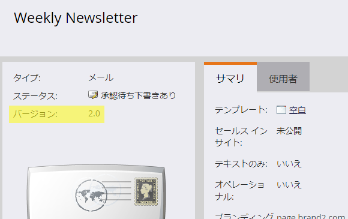

# [!DNL Email Editor 2.0] への移行 {#transitioning-to-email-editor}

2019年6月のリリース時点で、すべての Marketo サブスクリプションは [!DNL Email Editor 2.0] に移行されています。 [!DNL Email Editor 1.0] の非推奨（廃止予定）について詳しくは、[こちら](https://nation.marketo.com/docs/DOC-7038)を参照してください。

サブスクリプション内のメールとメールテンプレートには、バージョン番号が必要です。 そのバージョンは、アセットの概要ページに表示されます。

デフォルトでは、2016 年春のリリースより前、またはメールエディター 2.0 が無効になったリリースより後に作成された場合、既存のすべてのメールおよびメールテンプレートは v1.0 としてマークされます。 メールエディター 2.0 が自動的に有効になったため、次の動作が発生します。

* 新しいメールを作成する場合、[メールテンプレート選択ツール](email-template-picker-overview.md)が表示され、v2.0 のメールテンプレートを選択できるようになります。
* [!DNL Email Editor 2.0] でメールを作成または編集すると、結果のメールは&#x200B;**常に** v2.0 としてマークされます（v1.0 のメールテンプレートが使用されている場合も含む）。

[!DNL Email Editor 2.0] に移行する前にサブスクリプションに v1.0 のメールが含まれている場合、アセットの現在の状態に基づいて次の動作が発生します。

**承認済み** - 「ドラフトを編集」をクリックすると、承認済みメールの v2.0 ドラフトが作成されます。 その後、v2.0 ドラフトを承認すると、メールの承認済み状態はv2.0になり、v1.0に戻す方法はありません。
**ドラフト** - 「ドラフトを編集」をクリックすると、そのドラフトが自動的にv2.0としてマークされます。 この時点では、アセットの承認済みバージョンがないため、破棄してv1.0に戻すことはできません。
**ドラフトで承認済み** - 「ドラフトを編集」をクリックすると、そのドラフトが自動的にv2.0としてマークされます。 このため、ドラフトをv1.0に戻す方法もありません。

[!DNL Email Editor 2.0] に移行する前に、サブスクリプションに v1.0 のメールテンプレートが含まれている場合、次の動作が発生します。

**承認済み** - 「ドラフトを編集」をクリックすると、既存のメールテンプレートの v2.0 ドラフトが作成されます。
**ドラフト** - 「ドラフトを編集」をクリックすると、そのドラフトが自動的にv2.0としてマークされます。 この時点では、アセットの承認済みバージョンがないため、破棄してv1.0に戻すことはできません。
**ドラフトで承認済み** - 「ドラフトを編集」をクリックすると、そのドラフトが自動的にv2.0としてマークされます。 このため、ドラフトをv1.0に戻す方法もありません。

以前の v1.0（上記のいずれかの状態）でメールテンプレートを承認すると、次の動作が発生します。

（以前はv1.0）テンプレートを使用していた既存のv1.0電子メールの場合：
**Approved v1.0 email** – このメール用にv2.0 ドラフトが作成されますが、まだ新しく承認されたv2.0 テンプレートが使用されます。 テンプレートの変更も反映されます。
**ドラフト v1.0 メール** - ドラフトは、「ドラフトを編集」をクリックするまで v1.0 のままです。 その後、自動的に v2.0 としてマークされ、テンプレートの変更を受け取ります。
**ドラフト v1.0 メールで承認** - ドラフトは、「ドラフトを編集」をクリックするまで v1.0 のままです。 その後、自動的に v2.0 としてマークされ、テンプレートの変更を受け取ります。

（以前はv1.0）テンプレートを使用していた既存のv2.0 メールの場合：
**Approved v2.0 email** – このメール用にv2.0 ドラフトが作成され、新しく承認されたテンプレートを「使用」したまま、テンプレートの変更が受け取られます。
**ドラフト v2.0 email** - ドラフトは（v2.0）のままであり、テンプレートの変更を受け取ります。
**ドラフト v2.0 メールで承認** - ドラフトはそのまま（v2.0）となり、テンプレートの変更を受け取ります。

>[!CAUTION]
>
>v1.0 メールテンプレートのv2.0 ドラフトを承認した場合、テンプレートはv2.0になります。 v1.0に戻す方法は&#x200B;**ありません**。

注意事項

* 承認済みのメールが変更されることは&#x200B;**ありません**。

* 承認済みのメールテンプレートが変更されることは&#x200B;**ありません**。

* **まれ**&#x200B;に、v1.0 メールを [!DNL Email Editor 2.0] で開くことができない場合があります。 その場合は、ドラフトを破棄して、Marketo サポートにお問い合わせください。

>[!MORELIKETHIS]
>
>* [[!DNL Email Editor 2.0] 概要](/help/marketo/product-docs/email-marketing/general/email-editor-2/email-editor-v2-0-overview.md)
>* [メールテンプレートの構文](/help/marketo/product-docs/email-marketing/general/email-editor-2/email-template-syntax.md)
