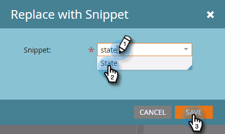

# メールにスニペットを追加する {#add-a-snippet-to-an-email}

スニペットは、メールやランディングページで使用できる、リッチテキストやグラフィックの再利用可能なブロックです。

>[!PREREQUISITES]
>
>[スニペットの作成](/help/marketo/product-docs/personalization/segmentation-and-snippets/snippets/create-a-snippet.md)

>[!NOTE]
>
>スニペットには [Marketo メール構文](/help/marketo/product-docs/email-marketing/general/email-editor-2/email-template-syntax.md)を埋め込むことはできません。これはメールでは動作&#x200B;**しません**。 スニペットは本文コンテンツ（HTML+テキスト）にする必要があります。

1. 目的のメールを選択して、「**[!UICONTROL ドラフトを編集]**」をクリックします。

   

1. スニペットに変換する編集可能領域を選択し、歯車アイコンをクリックして、「**[!UICONTROL スニペットに置換]**」を選択します。

   

1. 任意のスニペットを選択し、「**[!UICONTROL 保存]**」をクリックします。

   

   >[!NOTE]
   >
   >ドロップダウンには承認済みのスニペットのみが表示されます。

   

   >[!NOTE]
   >
   >スニペットを更新および承認するたびに、変更がメールに反映されます。 スニペットを[ドラフトなし](/help/marketo/product-docs/administration/users-and-roles/enable-no-draft-for-snippets.md)で承認しない限り、メールはドラフトされます

これにより、動的コンテンツをすばやく簡単に再利用できます。
