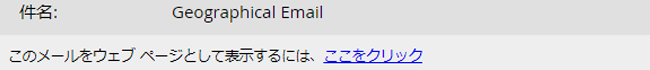

# 電子メ追加ールへのWebページリンクとしての表示 {#add-a-view-as-web-page-link-to-an-email}

電子メールの機能には制限があります（CSSには制限があり、JavaScriptやフォームはありません）。 表示をウェブページとして使用して、ブラウザに電子メールを表示するためのリンクを提供します。 これにより、マンチキンを使用して受信者にcookieを設定します。

>[!NOTE]
>
>新しい電子メールを作成する場合、Webページとしての表示は有効になりません。 有効にした後で電子メールを複製すると、この設定はコピーされます。

1. 電子メールを選択し、「 **ドラフトを編集**」をクリックします。

   

1. 電子メールエディターで、「 **電子メール設定**」をクリックします。

   

1. 「 **表示をWebページとして含める** 」ボックスをオンにし、「 **保存**」をクリックします。

   

次に、その見え方の例を示します。

>[!TIP]
>
>電子メールを送信するまで、表示はWebページのリンクとして表示されません。 表示にテストを送信します。

デフォルトのテキストを変更するには、「表示をWebページとして [編集する」メッセージを参照してください](../../../../product-docs/administration/email-setup/edit-the-view-as-web-page-message.md)。