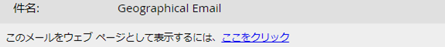

# メールに「Web ページとして表示」リンクを追加する {#add-a-view-as-web-page-link-to-an-email}

メールには限られた機能があります（CSS は限られており、JavaScript やフォームはありません）。 「Web ページとして表示」を使用して、メールをブラウザーに表示するためのリンクを提供します。 これにより、[!DNL Munchkin] を使用して受信者に cookie を設定します。

>[!NOTE]
>
>* メールを新規作成する場合、「Web ページとして表示」は有効になっていません。 有効にしてメールをクローンした場合、この設定はコピーされます。
>
>* 「Web ページとして表示」リンクは6か月後に期限切れになります。

1. メールを選択して、「**[!UICONTROL ドラフトを編集]**」をクリックします。

   

1. メールエディターで、「**[!UICONTROL メール設定]**」をクリックします。

   

1. 「**[!UICONTROL Web ページリンクとして表示を含める]**」ボックスのチェックをオンにして「**[!UICONTROL 保存]**」をクリックします。

   

次に例を示します。

>[!TIP]
>
>メールを送信するまで、「Web ページとして表示」リンクは表示されません。 テストを送信して確認してください。

デフォルトのテキストを変更するには、「[「Web ページとして表示」メッセージの編集](/help/marketo/product-docs/administration/email-setup/edit-the-view-as-web-page-message.md)」を参照してください。
