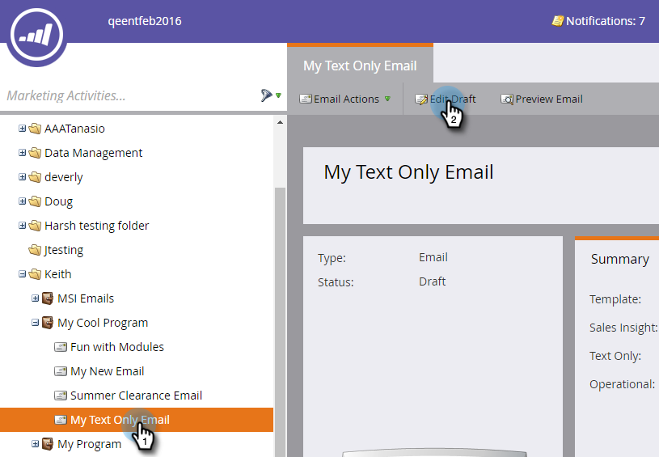

# テキストメールに追跡リンクを追加する {#add-tracked-links-to-a-text-email}

>[!PREREQUISITES]
>
>* [テキストのみのメールを作成する](/help/marketo/product-docs/email-marketing/general/creating-an-email/create-a-text-only-email.md)
>* [メールの要素を編集する](/help/marketo/product-docs/email-marketing/general/email-editor-2/edit-elements-in-an-email.md)

Marketo では、テキストのメールリンクを追跡できます。仕組みを見てみましょう。1. メールを選択して、「ドラフトを編集」をクリックします。

1. リンクを追加する編集可能領域をダブルクリックします。

   

1. URL を二重引用符で囲んで入力します（例：`[[www.domain.com/path/page.html]]`）。

   

1. エディターを閉じます。忘れずにドラフトを承認してください。

   

>[!NOTE]
>
>mktNoTok クラス機能は、テキストメール内の追跡可能なリンクでは機能しません。機能するのは HTML メールの場合のみです。

>[!TIP]
>
>再度確認するためにテストします。括弧が正しく入力されていることを確認します。

お疲れさまでした。
