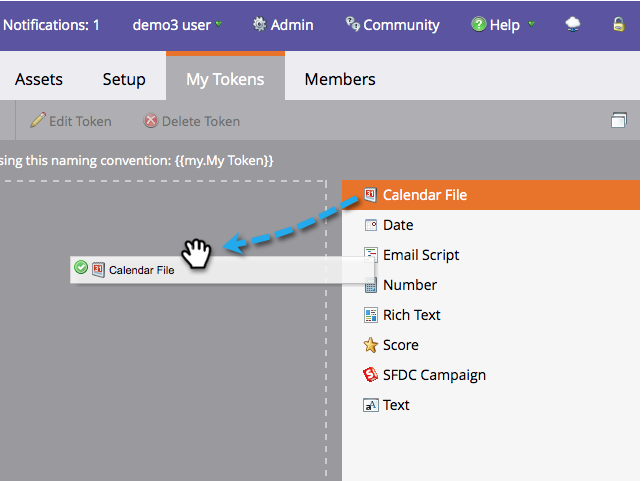

# 予定表イベント(.ics)ファイルの作成 {#create-a-calendar-event-ics-file}

カレンダーファイルトークンを使用すると、Marketorの電子メールやランディングページにカレンダーイベント(.ics)リンクを追加できます。

1. プログラム内で、「 **マイトークン** 」タブに移動します。

   

1. カレン **ダーファイル** ・トークンをキャンバスにドラッグします。

   

1. 「 **トークン名** 」と「 **編集**」を入力します。

   

1. 詳細を入力し、「 **保存**」をクリックします。

   

任務完了！ 必ずテストしてみてください。

>[!NOTE]
>
>**関連記事**
>
>* [電子メールにカレンダーイベント(.ics)を含める](include-a-calendar-event-ics-in-an-email.md)
>* [ランディングページに予定表イベントのICSファイルを含める](../../../../product-docs/demand-generation/landing-pages/personalizing-landing-pages/include-a-calendar-event-ics-file-in-a-landing-page.md)

>

