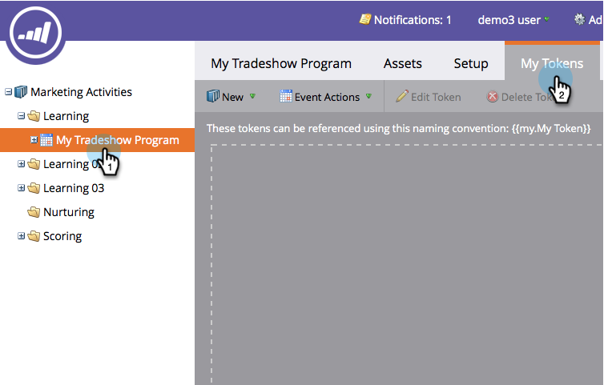

# カレンダーイベント（.ics）ファイルの作成 {#create-a-calendar-event-ics-file}

カレンダーファイルトークンを使用すると、Marketo のメールとランディングページにカレンダーイベント（.ics）のリンクを追加できます。

1. プログラム内で、「**[!UICONTROL マイトークン]**」タブに移動します。

   

1. **[!UICONTROL カレンダーファイル]**&#x200B;トークンをキャンバスにドラッグします。

   

1. **トークン名**&#x200B;を入力し、「**[!UICONTROL クリックして編集]**」をクリックします。

   

1. 詳細を入力し、「**[!UICONTROL 保存]**」をクリックします。

   

任務完了です。必ずテストしてみてください。

>[!MORELIKETHIS]
>
>* [メールにカレンダーイベント（.ics）を追加する](/help/marketo/product-docs/email-marketing/general/functions-in-the-editor/include-a-calendar-event-ics-in-an-email.md)
>* [ランディングページにカレンダーイベントの ICS ファイルを追加する](/help/marketo/product-docs/demand-generation/landing-pages/personalizing-landing-pages/include-a-calendar-event-ics-file-in-a-landing-page.md)
