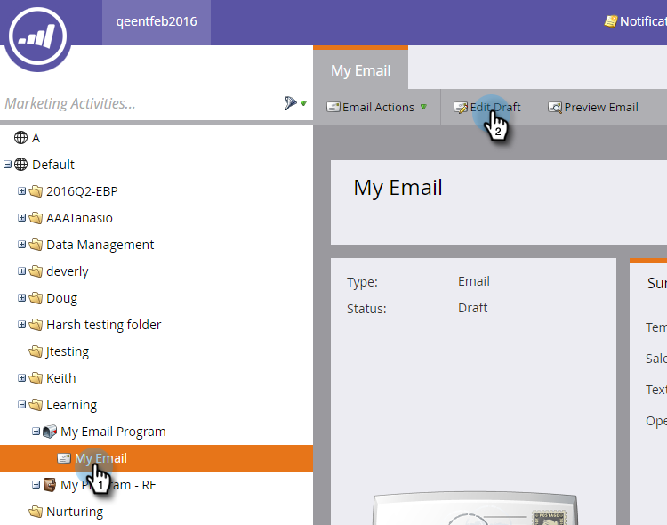
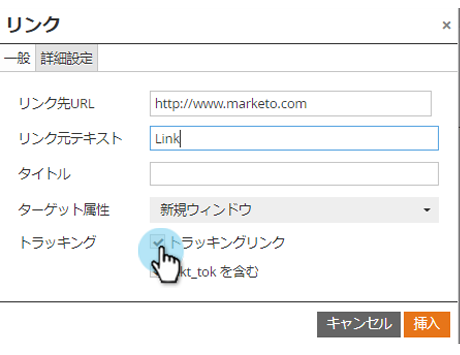

# 電子メールリンクの追跡の無効化 {#disable-tracking-for-an-email-link}

電子メール内のリンクに対して **マーケティング担当者の追跡URL** を有効にしない場合があります。 これは、リンク先ページがURLパラメーターをサポートしていないため、リンクが壊れる場合に役立ちます。

1. 電子メールを選択し、「 **ドラフトを** 編集 **」をクリックします**。

   

1. リンクを含む編集可能なセクションを重複キーを押しながらクリックします。

   

1. 該当するリンクをクリックし、「リンクを **挿入/編集** 」ボタンをクリックします。

   

1. リンクを編集ポップアップで、「リンクを **追跡** 」チェックボックスをオフにします。

   

1. 「mkt_tokを **含める」ボックスが非表示になり** ます。 「 **適用**」をクリックします。

   

   >[!TIP]
   >
   >「mkt_tokを **含める」のチェックを外しても、リンクは引き続き追跡できますが** 、リダイレクト後は、リンク先URLにmkt_tokクエリ文字列パラメーターが含まれなくなります。 このパラメーターは、人物アクティビティの適切な追跡（例えば、人物が電子メールから登録解除する場合）を確実に行うために、MarketoランディングページおよびMunchkinが使用します。 パラメーターの存在が原因でWebサイト上で奇妙な動作が見られない限り、この機能の使用は避けてください。

1. 「 **保存**」をクリックします。

   

   >[!TIP]
   >
   >電子メール **テンプレート内のリンクのクリック追跡を無効にしますか**? 次の形式を使用します。
   >`<a class="mktNoTrack" href="http://www.mywebsite.com">This link does not have tracking</a>`\
   >この導入に関するヘルプが必要な場合は、Web開発者にお問い合わせください。

ナイス！ リンクの追跡を無効にしています。
