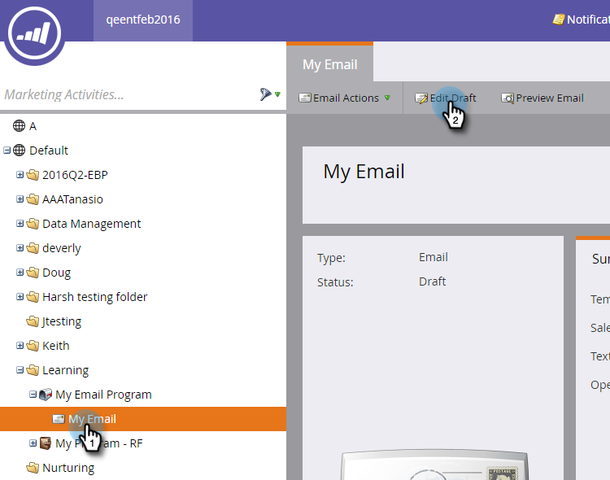
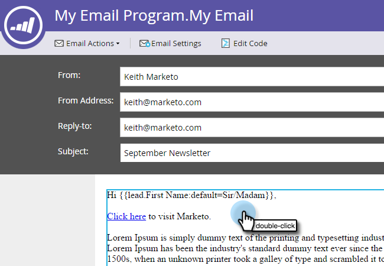
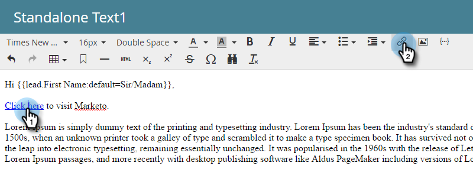
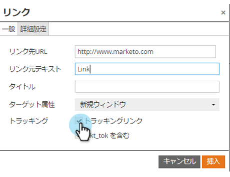
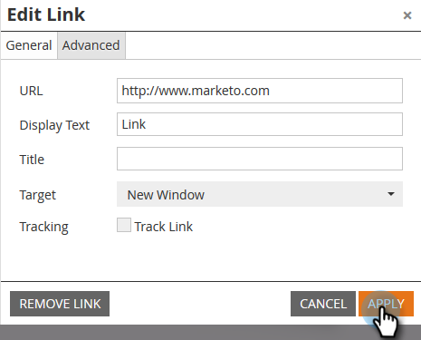
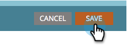

# メールリンクのトラッキングを無効にする {#disable-tracking-for-an-email-link}

場合によっては、メールのリンクで **Marketo の URL トラッキング**&#x200B;機能を有効にしたくないことがあります。 これは、宛先ページが URL パラメーターをサポートしておらず、リンク切れになる可能性がある場合などに役立ちます。&#x200B;

また、メールを 365 日以上前に送信し&#x200B;**、**&#x200B;過去 180 日間にそのリンクをクリックしていない場合、Marketo Engage はデータベースから URL へのルートを削除するので、リンクが破損します。 そのため、リンクを永続的にする必要がある場合は、トラッキングを無効にする必要があります。

1. メールを選択して、「**[!UICONTROL ドラフトを編集]**」をクリックします。

   

1. リンクを含む編集可能なセクションをダブルクリックします。

   

1. 問題のリンクをクリックして、「**リンクの挿入／編集**」ボタンをクリックします。

   

1. リンクの編集ポップアップで、「**[!UICONTROL リンクの追跡]**」チェックボックスをオフにします。

   

1. **[!UICONTROL Include mkt_tok] チェックボックス**&#x200B;が消えます。 「**[!UICONTROL 適用]**」をクリックします。

   

   >[!TIP]
   >
   >**Include mkt_tok** のみをオフにしてもリンクのトラッキングは可能ですが、リダイレクト後、宛先 URL に mkt_tok クエリ文字列パラメーターは含まれません。 このパラメーターは、リードのアクティビティを適切にトラッキングするために（リードがメールを登録解除した場合など）、Marketo のランディングページと Munchkin で使用されます。 パラメーターが存在するため、web サイトで奇妙な動作が表示されない限り、この機能を使用しないでください。

1. 「**[!UICONTROL 保存]**」をクリックします。

   

   >[!CAUTION]
   >
   >メールテンプレート内のリンクや[テキストバージョン](/help/marketo/product-docs/email-marketing/general/creating-an-email/edit-the-text-version-of-an-email.md){target="_blank"}のメールのクリックトラッキングを無効にする場合は、文字列の末尾ではなく&#x200B;*先頭*&#x200B;に `mktNoTrack` を追加します（例：`<a class="mktNoTrack" href="https://www.mywebsite.com">This link does not have tracking</a>`）。 そうしないと、リンクが表示されなくなる可能性があります。 上記のコードを実装する際にヘルプが必要な場合は、web 開発者にお問い合わせください。
