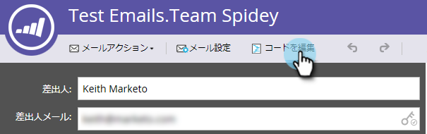
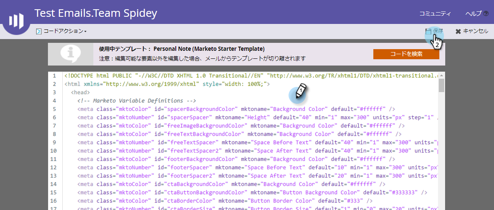
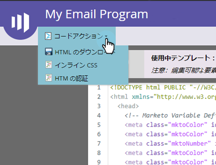
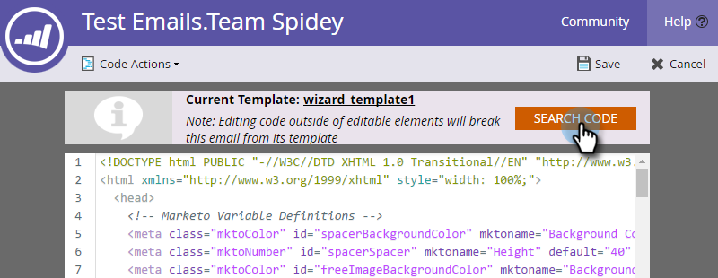

# 電子メールのHTMLの編集{#edit-an-emails-html}

電子メールの基になるHTMLを変更する必要が生じる場合があります。 電子メールのコードを設計および作成する際に、外部システムを使用する場合があります。 どちらの方法でも、電子メールエディター内からコードの読み込みや編集を簡単に行うことができます。

## HTMLの編集{#edit-html}

1. 電子メールを選択し、「**ドラフトを編集**」をクリックします。

   

1. 「**コードを編集**」をクリックします。

   

1. 変更を加えます。 終了したら「**保存**」をクリックします。

   

   >[!NOTE]
   >
   >好きなものを変えなさい。 HTML全体を置き換えたり、小さな調整を行ったりできます。

1. **コードアクション**&#x200B;ドロップダウンをクリックして、コードを.htmlファイルとしてダウンロードするか、CSSをインラインでダウンロードするか、HTMLを検証します。

   

   >[!NOTE]
   >
   >電子メールのベストプラクティスは、すべてのスタイルをインラインにすることです。 `<head>`セクション内のCSSをサポートしていない電子メールクライアントもあります。

## テンプレートからの電子メールの破棄{#breaking-an-email-from-its-template}

次のコード変更は、**テンプレートからの電子メールを**&#x200B;壊しません。

* 任意のモジュールの内容の編集（モジュール内に新しい要素を追加する）
* コンテナへの新しいモジュールの追加
* コンテナからのモジュールの削除

* モジュール外の任意の要素のmkto固有の属性（例えば、&quot;mktoName&quot;や&quot;mktoImgUrl&quot;）の変更
* 任意の要素のコンテンツの編集（リッチテキスト、画像、ビデオなど） モジュール外

コードエディター&#x200B;**でできるこれらの操作は、**&#x200B;電子メールをテンプレートから削除します。

* 要素またはモジュール以外のコード内での変更
* モジュール外の要素の、mkto以外の属性（&quot;id&quot;や&quot;style&quot;など）の追加または変更
* モジュール外の要素の削除

## 検索コード{#search-code}

電子メールのHTMLコード内のコンテンツを効率的に検索および置換するには、検索コード機能を使用します。

1. 電子メールのコードで、「**検索コード**」をクリックします。

   

1. 検索する文字列を入力し、「次を検索&#x200B;**次を検索**」をクリックして次を検索します。逆方向に検索するには「**前を検索**」をクリックします。 また、**置換**&#x200B;と&#x200B;**すべて置換**&#x200B;を選択することもできます。

   

1. 終了したら「**閉じる**」をクリックします。

   

   >[!NOTE]
   >
   >「検索コード」は、[電子メールテンプレートエディター](/help/marketo/product-docs/email-marketing/general/email-editor-2/create-an-email-template.md)でも利用できます。

Marketoの組み込み機能を使用して電子メールの編集を継続することをお勧めしますが、必要に応じて柔軟に行うことができます。
