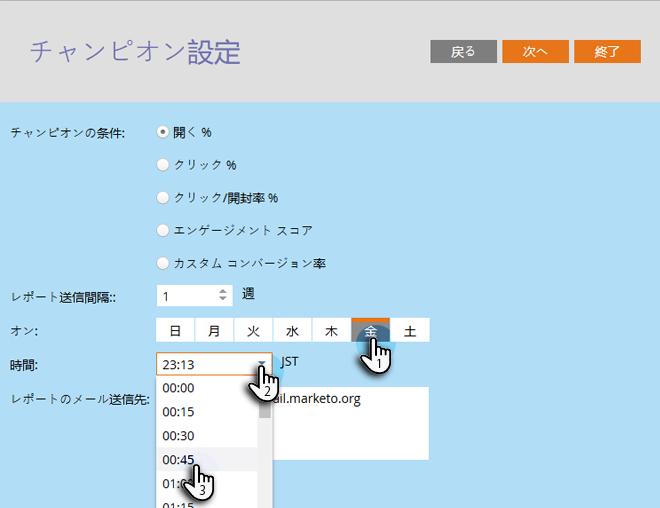
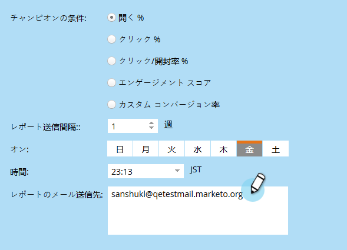
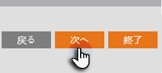
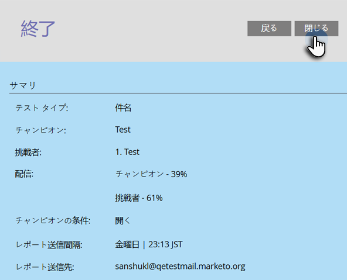
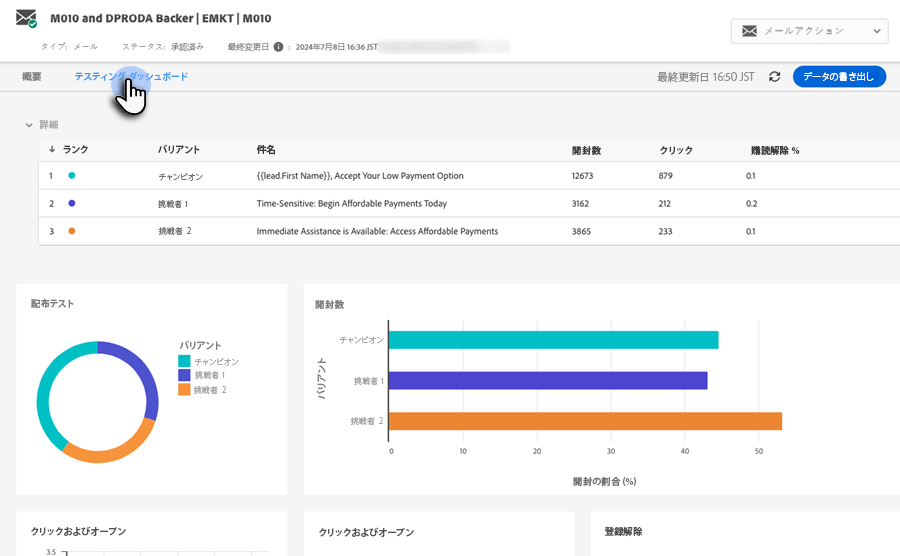

# チャンピオン/チャレンジャー：分析 {#champion-challenger-analytics}

役に立つ分析については、レポートアラートを受け取ったり、チャンピオン/チャレンジャーダッシュボードを確認したりします。

>[!PREREQUISITES]
>
>[チャンピオン／挑戦者：チャンピオンの条件の定義](/help/marketo/product-docs/email-marketing/general/functions-in-the-editor/email-tests-champion-challenger/champion-challenger-define-champion-criteria.md)

## レポートアラートの設定 {#configure-report-alerts}

Marketo では、メールテストの進行状況に関するレポートが送信されます。スケジュールする方法を説明しましょう。

1. 週に 1 回、金曜日の午前 9 時にレポートを送信するようにスケジュールします。

   

   >[!TIP]
   >
   >必要に応じて、複数の曜日を選択できます。クリックして選択し、再度クリックして選択を解除します。

1. レポートの送信先のメールアドレスを入力します。

   

1. 「**次へ**」をクリックします。

   

1. すべての情報が正しいことを確認し、「**閉じる**」をクリックします。

   

   レポートには、テストタイプ、勝者条件、メール開封数などの詳細が含まれます。 また、テスト自体への直接リンクも表示され、勝者を発表できます。素晴らしいものです。

## Champion/Challenger ダッシュボード {#champion-challenger-dashboard}

チャンピオン/チャレンジャーダッシュボードは、チャンピオン/チャレンジャー実験のコントロールとバリアントのパフォーマンス（開封数、クリック数、購読解除率、メールテストの設定中に使用されたその他の変数）に関する詳細な分析を提供します。 また、このダッシュボードは、様々な E メールバリアントのターゲットオーディエンスに関する配信の詳細や、すべてのバリアントの開封数、クリック数、クリック数の開封率、購読解除数の集計割合も提供します。

