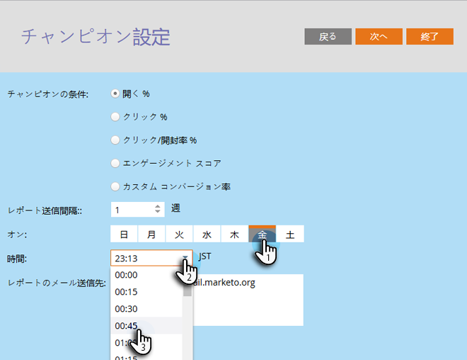
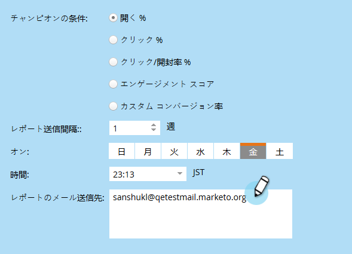
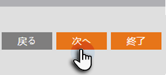
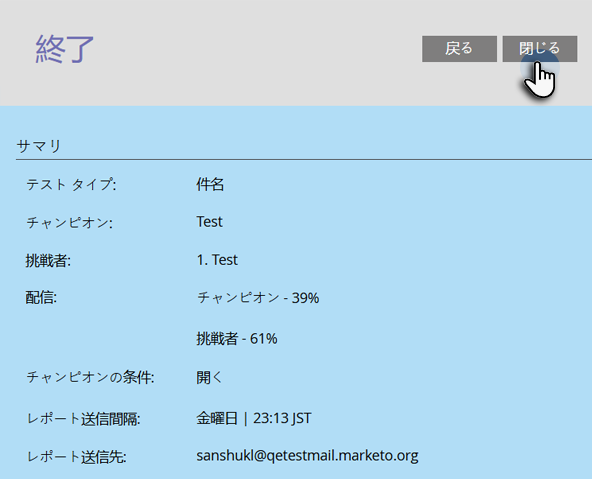
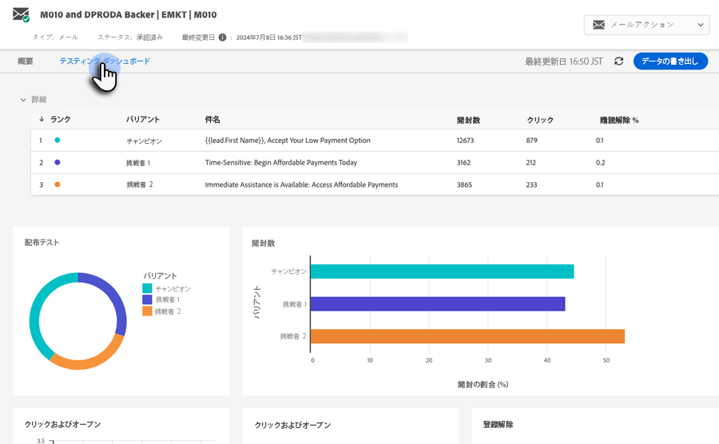

# チャンピオン／挑戦者：分析 {#champion-challenger-analytics}

レポートアラートを受信したり、チャンピオン／挑戦者ダッシュボードを確認して役立つ分析を入手したりできます。

>[!PREREQUISITES]
>
>[チャンピオン／挑戦者：チャンピオンの条件の定義](/help/marketo/product-docs/email-marketing/general/functions-in-the-editor/email-tests-champion-challenger/champion-challenger-define-champion-criteria.md)

## レポートアラートの設定 {#configure-report-alerts}

Marketo では、メールテストの進行状況に関するレポートが送信されます。 スケジュールする方法を説明しましょう。

1. 週に 1 回、金曜日の午前 9 時にレポートを送信するようにスケジュールします。

   

   >[!TIP]
   >
   >必要に応じて、複数の曜日を選択できます。 クリックして選択し、再度クリックして選択を解除します。

1. レポートの送信先のメールアドレスを入力します。

   

1. 「**次へ**」をクリックします。

   

1. すべての情報が正しいことを確認し、「**閉じる**」をクリックします。

   

   レポートには、テストタイプ、勝者の条件、メールの開封数などの詳細情報が含まれます。 また、テスト自体への直接リンクも表示され、勝者を発表できます。 素晴らしいものです。

## チャンピオン／挑戦者ダッシュボード {#champion-challenger-dashboard}

チャンピオン／挑戦者ダッシュボードには、チャンピオン／挑戦者実験におけるコントロールとバリアントのパフォーマンスに関する詳細な分析（開封数、クリック数、登録解除率、メールテストの設定中に使用されるその他の変数）が用意されています。 また、ダッシュボードには、様々なメールバリアントのターゲットオーディエンスに関する配分の詳細と、すべてのバリアントの開封数、クリック数、クリック／開封率、登録解除数の集計割合も表示されます。

