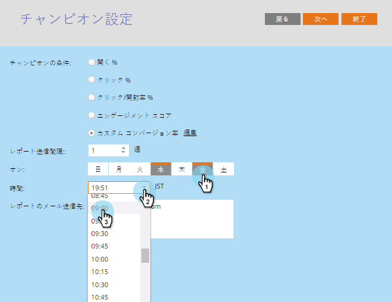

# チャンピオン/チャレンジャー：レポートアラートの設定 {#champion-challenger-configure-report-alerts}

Marketoから、電子メールテストの進行状況に関するレポートが送信されます。 スケジュールを設定する方法を次に示します。

>[!NOTE]
>
>**前提条件**
>
>* [チャンピオン/チャレンジャー：チャンピオンの基準の定義](champion-challenger-define-champion-criteria.md)

>

1. 週に1回、金曜日の午前9時にレポートを送るようにスケジュールします。

   

   >[!TIP]
   >
   >必要に応じて、複数の曜日を選択できます。 クリックして選択し、もう一度クリックして選択を解除します。

1. レポートの送信先の電子メールアドレスを入力します。

   

1. 「 **次へ**」をクリックします。

   

1. すべての情報が正しいことを確認し、「 **閉じる**」をクリックします。

   

   このレポートには、次のような役立つ詳細情報が含まれます。テストタイプ、勝者条件、電子メールが開かれた回数など。 また、テスト自体への直接リンクがあり、推奨結果を宣言できます。 かっこいい。

   >[!NOTE]
   >
   >**関連記事**
   >
   >    
   >    
   >    * [チャンピオン/チャレンジャー：電子メールテストの承認](champion-challenger-approve-your-email-test.md)

