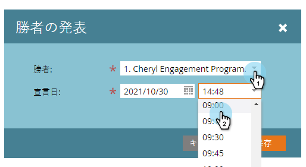

# チャンピオン／挑戦者：チャンピオンの発表 {#champion-challenger-declare-a-champion}

準備が整ったら、メールテストのチャンピオンを発表できます。

>[!MORELIKETHIS]
>
>[チャンピオン／挑戦者：メールテストの承認](/help/marketo/product-docs/email-marketing/general/functions-in-the-editor/email-tests-champion-challenger/champion-challenger-approve-your-email-test.md)

1. **マーケティング活動**&#x200B;に移動します。

   

1. メールテストを探して右クリックし、「**チャンピオンの発表**」をクリックします。

   

1. 任意の&#x200B;**勝者**&#x200B;を選択します。

   

1. **宣言日**&#x200B;を設定します。

   >[!NOTE]
   >
   >**宣言日**&#x200B;まで、Marketo は引き続き古いチャンピオンと挑戦者を送信します。日時に達すると、新しいチャンピオンのみが送信されます。

   

   >[!CAUTION]
   >
   >デフォルトの&#x200B;**宣言日**&#x200B;は、今日ではなく明日です。

1. 時間を選択して、「**保存**」をクリックします。

   

   完了しました。これで、コンテンツを強化するために、キャンペーンを中断することなく、メールテストを簡単に実行する方法を知ることができました。
