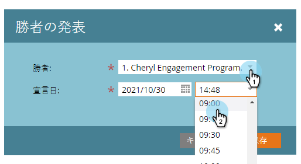

# チャンピオン／挑戦者：チャンピオンの発表 {#champion-challenger-declare-a-champion}

準備ができたら、メールテストのチャンピオンを宣言しましょう。

>[!MORELIKETHIS]
>
>[チャンピオン／挑戦者：メールテストの承認](/help/marketo/product-docs/email-marketing/general/functions-in-the-editor/email-tests-champion-challenger/champion-challenger-approve-your-email-test.md)

1. **[!UICONTROL マーケティングアクティビティ]**&#x200B;に移動します。

   

1. メールテストを探して右クリックし、「**[!UICONTROL チャンピオンの発表]**」をクリックします。

   

1. 任意の&#x200B;**[!UICONTROL 勝者]**&#x200B;を選択します。

   

1. **[!UICONTROL 宣言日]**&#x200B;を設定します。

   >[!NOTE]
   >
   >**[!UICONTROL 宣言日]**&#x200B;まで、Marketo は引き続き古いチャンピオンと挑戦者を送信します。 日時に達すると、新しいチャンピオンのみが送信されます。

   

   >[!CAUTION]
   >
   >デフォルトの&#x200B;**[!UICONTROL 宣言日]**&#x200B;は、今日ではなく明日です。

1. 時間を選択して、「**[!UICONTROL 保存]**」をクリックします。

   

   完了しました。 これで、コンテンツを強化するために、キャンペーンを中断することなく、メールテストを簡単に実行する方法を知ることができました。
