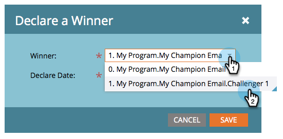

# チャンピオン/チャレンジャー：チャンピオンを宣言{#champion-challenger-declare-a-champion}

準備が整ったら、電子メールテストのチャンピオンを宣言できます。

>[!MORELIKETHIS]
>
>* [チャンピオン/チャレンジャー：電子メールテストの承認](champion-challenger-approve-your-email-test.md)

1. **マーケティングアクティビティ**&#x200B;に移動します。

   

1. 電子メールテストを見つけて右クリックし、**「チャンピオンを宣言**」をクリックします。

   

1. 選択した&#x200B;**推奨結果**&#x200B;を選択します。

   

1. **Declare Date**&#x200B;を設定します。

   >[!NOTE]
   >
   >**日付の宣言**&#x200B;まで、マーケット氏は古いチャンピオンと挑戦者を送り続けます。 日時に達すると、新しいチャンピオンのみが送信されます。

   

   >[!CAUTION]
   >
   >デフォルトの&#x200B;**Declare Date**&#x200B;は、今日ではなく明日です。

   時間を選択し、「**保存**」をクリックします。

   

   Rad! これで、キャンペーンに中断をかけずに、電子メールテストを簡単に実行してコンテンツを改善する方法がわかります。
