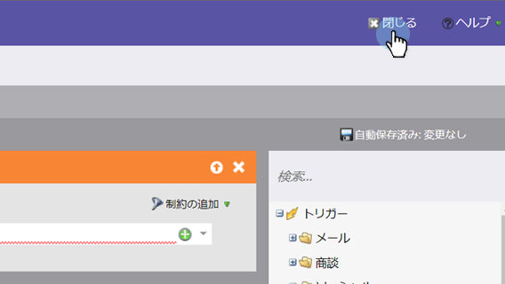

# チャンピオン／挑戦者：チャンピオンの条件の定義 {#champion-challenger-define-champion-criteria}

テストタイプを設定したら、チャンピオンの条件を定義する必要があります。ここでは、その方法を説明します。

>[!PREREQUISITES]
>
>[メールチャンピオン／挑戦者の追加](/help/marketo/product-docs/email-marketing/general/functions-in-the-editor/email-tests-champion-challenger/add-an-email-champion-challenger.md)

## 標準的なチャンピオンの条件 {#standard-champion-criteria}

1. 使用可能な&#x200B;**チャンピオンの条件**&#x200B;の 1 つを選択します。

   

   >[!NOTE]
   >
   >この指標をトラッキングして、データを含むレポートをメールで送信します。

1. デフォルトの&#x200B;**チャンピオンの条件**&#x200B;の 1 つを選択した場合は、[チャンピオン／挑戦者：レポートアラートの設定](/help/marketo/product-docs/email-marketing/general/functions-in-the-editor/email-tests-champion-challenger/champion-challenger-configure-report-alerts.md)に進みます。

## カスタムのチャンピオンの条件 {#custom-champion-criteria}

1. 手を加える場合は、「**カスタムコンバージョン**」を選択し、「**編集**」をクリックすることで、カスタマイズできます。

   

   >[!NOTE]
   >
   >これにより、トリガーとフィルターを使用して、任意のイベントをコンバージョンとして設定できます。

1. ウィンドウがポップアップ表示されるので、目的のトリガーを探して、キャンバスにドラッグします。

   

1. トリガーを定義します。

   

   Marketo では、このメールプログラムからメールを送信したユーザーのトリガーのみを許可します。「メール送信済み」フィルターを追加する必要はありません。

1. 「**閉じる**」をクリックします。

   

   これで完了です。次に、レポートのスケジュールを設定します。

   >[!MORELIKETHIS]
   >
   >[チャンピオン／挑戦者：レポートアラートの設定](/help/marketo/product-docs/email-marketing/general/functions-in-the-editor/email-tests-champion-challenger/champion-challenger-configure-report-alerts.md)
