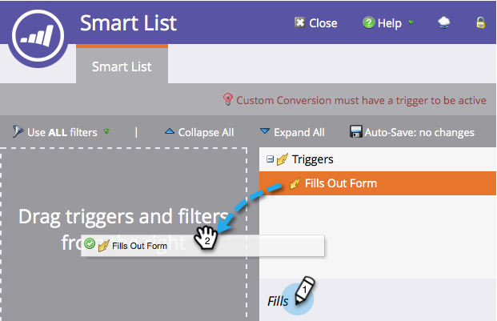

# チャンピオン/チャレンジャー：チャンピオン条件の定義{#champion-challenger-define-champion-criteria}

テストタイプを設定したら、チャンピオンの条件を定義する必要があります。 これが方法です。

>[!PREREQUISITES]
>
>[Eメール追加チャンピオン/対抗者](/help/marketo/product-docs/email-marketing/general/functions-in-the-editor/email-tests-champion-challenger/add-an-email-champion-challenger.md)

## 標準的なチャンピオンの基準{#standard-champion-criteria}

1. 利用可能な&#x200B;**チャンピオン条件**&#x200B;の1つを選択します。

   

   >[!NOTE]
   >
   >この指標を追跡し、データを含むレポートを電子メールで送信します。

1. デフォルトの&#x200B;**チャンピオン条件**&#x200B;の1つを選択した場合は、[チャンピオン/チャレンジャーに進みます。レポートアラートの設定](/help/marketo/product-docs/email-marketing/general/functions-in-the-editor/email-tests-champion-challenger/champion-challenger-configure-report-alerts.md)!

## カスタムチャンピオンの条件{#custom-champion-criteria}

1. 気に入ったい場合は、「**カスタムコンバージョン**」を選択し、「**編集**」をクリックして、カスタムコンバージョンを行うことができます。

   

   >[!NOTE]
   >
   >これにより、トリガーとフィルターを使用して、すべてのイベントをコンバージョンとして設定できます。

1. ウィンドウがポップアップします。選択したトリガーを見つけ、キャンバスにドラッグします。

   

1. トリガーを定義します。

   

   Marketorは、この電子メールプログラムから電子メールを送信した人のトリガーのみを許可します。 「送信済みの電子メール」フィルターを追加する必要はありません。

1. 「**閉じる**」をクリックします。

   

   素晴らしい！ 次に、レポートのスケジュールを設定します。

   >[!MORELIKETHIS]
   >
   >[チャンピオン/チャレンジャー：レポートアラートの設定](/help/marketo/product-docs/email-marketing/general/functions-in-the-editor/email-tests-champion-challenger/champion-challenger-configure-report-alerts.md)
