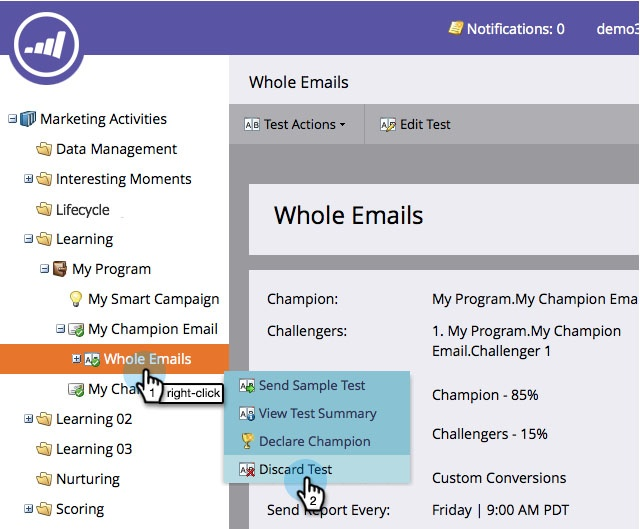
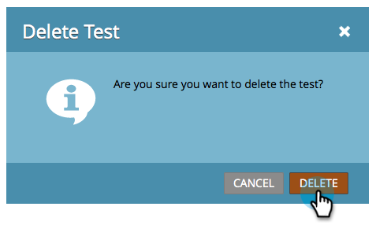

# チャンピオン／挑戦者：メールテストの破棄 {#champion-challenger-discard-an-email-test}

メールテストの実行を続行しないことにした場合は、いつでも破棄できます。 手順は以下のとおりです。

>[!PREREQUISITES]
>
>[チャンピオン／挑戦者：メールテストの承認](/help/marketo/product-docs/email-marketing/general/functions-in-the-editor/email-tests-champion-challenger/champion-challenger-approve-your-email-test.md)

1. **[!UICONTROL マーケティングアクティビティ]**&#x200B;に移動します。

   

1. メールテストを探して右クリックし、「**[!UICONTROL テストを廃棄]**」をクリックします。

   

1. 「**[!UICONTROL 削除]**」をクリックして確定します。

   

   完了です！ テストを再度設定する場合は、[メールチャンピオン／挑戦者を追加](/help/marketo/product-docs/email-marketing/general/functions-in-the-editor/email-tests-champion-challenger/add-an-email-champion-challenger.md)します。
