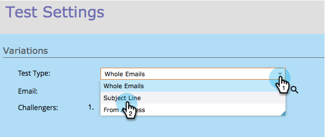

# チャンピオン/チャレンジャー：件名行 {#champion-challenger-subject-line}

複数の件名行を簡単にテストできます。 テストが終了したら、最も効果的な電子メールを送信します。 その方法を次に示します。

>[!NOTE]
>
>**前提条件**
>
>* [Eメール追加チャンピオン/対抗者](add-an-email-champion-challenger.md)

>

1. 電子メールテストエディターで、「**Test Type **」ドロップダウンリストから「 **件名行** 」を選択します。

   

   >[!NOTE]
   >
   >サブジェクトテストでは、最初に入力したサブジェクトラインが **チャンピオンに指定されます**。 その後の件名行は **対抗と呼ばれます**。

1. 対抗の対象明細を入力 **します**。

   

   >[!TIP]
   >
   >複数の対抗を作成する場合は、プラス記号をクリックし、別の件名を入力します。

1. スライダーをドラッグして、チャンピオンの件名行と対抗の件名行を受け取る人の割合を分割する割合を指定します。

   

   >[!NOTE]
   >
   >**例**
   >
   >
   >上に示した分布では、スマートリストで指定された合計オーディエンスの10%に対抗の件名行を持つ電子メールの1つが届き、90%にチャンピオンの件名行を持つ電子メールが届きます。 複数の対抗の件名行を持つ電子メールは、10%が等しく共有されます。 テストが終了したら、勝者を手動で宣言できます。 それ以降は、今後すべてのユーザーがパフォーマンスの高いコンテンツを受け取ります。

   統計的信頼性を得るには、選択した割合に十分な人数が含まれていることを確認して、テストが有効であることを確認します。 断定的な結果にだまされるな。  [統計的信頼性に関する情報が今まで以上に多い](http://en.wikipedia.org/wiki/Confidence_interval)。

1. 「 **次へ**」をクリックします。

   

   進め！ 続けよう。

   >[!NOTE]
   >
   >**関連記事**
   >
   >
   >[チャンピオン/チャレンジャー：チャンピオンの基準の定義](champion-challenger-define-champion-criteria.md)

