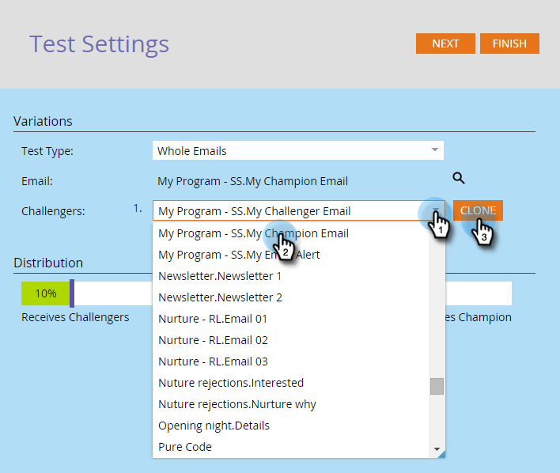

# チャンピオン／挑戦者：メール全体 {#champion-challenger-whole-emails}

メール全体を相互にテストします。テストが終了したら、最もパフォーマンスの高いものを送信します。

>[!PREREQUISITES]
>
>[メールチャンピオン／挑戦者の追加](/help/marketo/product-docs/email-marketing/general/functions-in-the-editor/email-tests-champion-challenger/add-an-email-champion-challenger.md)

1. メールテストエディターの&#x200B;**テストタイプ**&#x200B;ドロップダウンで「**メール全体**」を選択します。

   

   >[!NOTE]
   >
   >注意：元のメールはチャンピオンです。挑戦者はそれに対抗します。

1. **挑戦者**&#x200B;メールを探して選択し、「**複製**」をクリックします。

   

   >[!TIP]
   >
   >複製により、メールテスト中に挑戦者メールのコピーを作成します。

1. スライダーをドラッグして、挑戦者メールとチャンピオンメールを受信するユーザーの割合を決定します。

   

   >[!NOTE]
   >
   >**例**
   >
   >上に示した配分では、スマートリストに指定された合計オーディエンスの 15％に対して、挑戦者メールの 1 つが割り当てられ、85％がチャンピオンメールを受信します。複数の挑戦者メールでは、15％が同等に共有されます。テストが完了したら、勝者を手動で発表できます。それ以降、今後のすべてのユーザーに、よりパフォーマンスの高いコンテンツが提供されます。

   統計的な信頼性を得るには、挑戦者に割り当てる割合に、テストが有効になるのに十分なユーザーが含まれていることを確認します。決定的でない結果に惑わされないようにします。

   [統計的な信頼性に関する詳細情報](https://en.wikipedia.org/wiki/Confidence_interval)。

1. 「**次へ**」をクリックします。

   

1. 進展しました。この調子で頑張りましょう。

   >[!MORELIKETHIS]
   >
   >[チャンピオン／挑戦者：チャンピオンの条件の定義](/help/marketo/product-docs/email-marketing/general/functions-in-the-editor/email-tests-champion-challenger/champion-challenger-define-champion-criteria.md)
