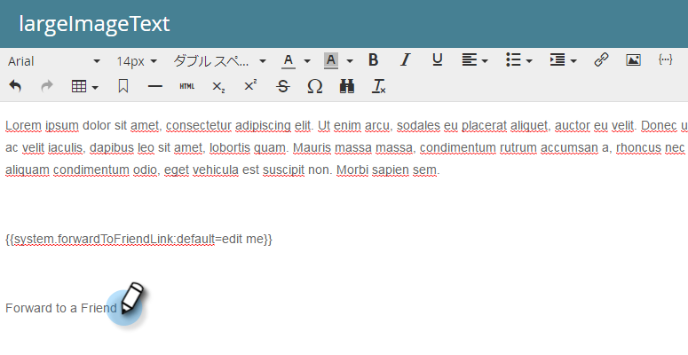
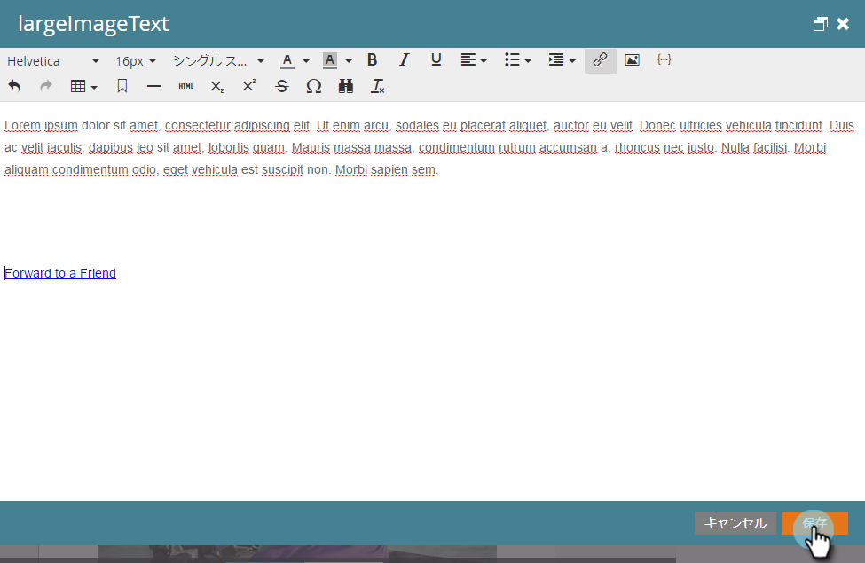
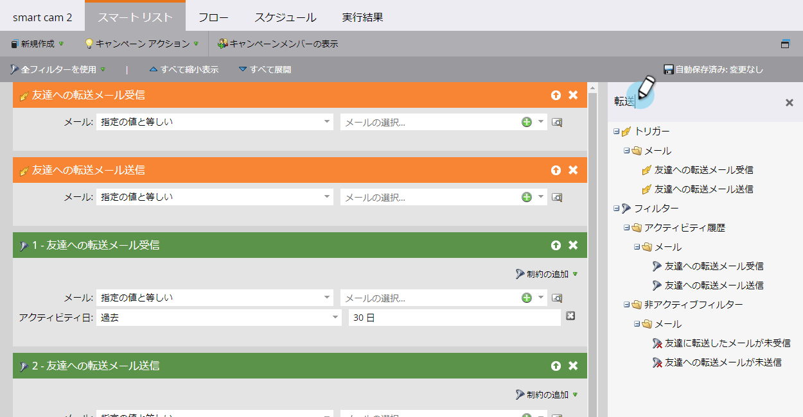

# 電子メール内のフレンドリンクに転送 {#forward-to-a-friend-link-in-emails}

電子メールに「友達に転送」リンクを追加すると、このリンクを介して転送された電子メールを受信した人を追跡でき、データベースにまだ存在しない場合は、新しい人として自動的に追加できます。

例えば、Keithが「友達に転送」リンクを使用して、未知のユーザーMarkに電子メールを転送するとします。 Markが新しいユーザーとして自動的に追加され、独自のCookieが割り当てられ、Markの電子メールおよびWebアクティビティーがリンクされます。 ただし、Keithが電子メールクライアントで「転送」ボタンを使用すると、Markは誤ってKeithとしてCookieを受け取り、そのアクティビティはKeithとしてログに記録されます。

## 電子メ追加ールテンプレートへのリンク {#add-the-link-to-an-email-template}

1. Design **Studioに移動します**。

   

1. リンクを追加する電子メールテンプレートを探して選択します。 「ドラフト **を編集**」をクリックします。

   

1. 「友達に転送」リンクを表示する場所に次のHTMLコードを貼り付けます（この記事に関するヘルプが必要な場合は、Web開発者にお問い合わせください）。

   `<pre data-theme="Confluence"><a href="{{system.forwardToFriendLink}}">Forward to Friend</a></pre>`

   

   >[!TIP]
   >
   >
   >リンクにスタイルを追加して、見た目をより良くすることができます。 次に例を示します。
   >
   >`<a href="{{system.forwardToFriendLink}}" style="font-family:arial, sans-serif; padding:10px; position:absolute; right:0px;">Forward to Friend</a>`

   >[!CAUTION]
   >
   >電子メールテンプレートでは、スタイル **位置：relative** を使用しないことをお勧めします。 「友達に転送」ボックスの位置と表示に問題が生じる場合があります。

1. 「 **プレビュードラフト** 」をクリックして、テンプレートが希望どおりに表示されることを確認します。

   

   >[!NOTE]
   >
   >**Reminder**
   >
   >変更を適用するには、必ずテンプレートのドラフトを承認してください。

   これで、そのテンプレートを使用する電子メールはすべて「友達に転送」リンクになります。 電子メール受信者がクリックすると、「友達に転送」ボックスが付いたWebバージョンの電子メールが送信されます。
   

## 個追加々の電子メールへのリンク {#add-the-link-to-an-individual-email}

「友達に転送」リンクを電子メールに直接追加することもできます。

1. リンクを含める電子メールを開き、編集可能な領域で重複クリックします。

   

1. リンクを表示する場所にカーソルを置き、「トークンの **挿入** 」ボタンをクリックします。

   

1. トークンを選択し **`{{system.forwardToFriendLink}}`** ます。

   

   >[!NOTE]
   >
   >このトークンは、「友達に転送」ボックスが付いた電子メールのWebバージョンのURLです。

1. リンクの表示テキストを書き込みます（「友達に転送」など）。

   

1. Ctrl + Xキー(Windows)またはCommand + Xキー(Mac)を使用して **`{{system.forwardToFriendLink}}`** トークンを切り取ります。 「友達に転送」をハイライトし、「リンクを **挿入/編集** 」ボタンをクリックします。

   

1. CtrlまたはCommandキーを押しながらVキーを押して、 **`{{system.forwardToFriendLink}}`** トークンを「 **URL** 」ボックスに貼り付け、「**挿入**」をクリックします。

   

1. 編集とプレビューを新しいリンクに保存します。

   

   >[!NOTE]
   >
   >「友達に転送」という電子メールを受け取って新しいユーザーが追加された場合、デフォルトでは、マーケティング電子メールの登録が解除されます。

## 表示転送アクティビティ {#view-forwarding-activity}

ユーザーのアクティビティログで、誰が電子メールを転送および受信したかを確認できます。

1. に移動し **`Database`**&#x200B;ます。

   

1. 表示アクティビティの対象となるユーザーを重複クリックします。

   

1. 「 **アクティビティログ** 」タブに移動します。 詳細を表示するには、重複キーを押しながら「 **友達の電子メールに** 受信した」または「友達の電子メールに **送信した** 」をクリックします。

   

   >[!NOTE]
   >
   >**定義**
   >
   >
   >「友人の電子メールに転送された受信者」の場合、人物IDは電子メールを転送した人です。
   >
   >
   >「友人の電子メールに送信」の場合、人物IDは電子メールを受信した人です。

   

1. 個人をIDで表示するには、** Person ID**をコピーしてURLの末尾に貼り付けます（このURLの先頭はMarketorインスタンスに依存します）。

   `<pre data-theme="Confluence">...marketo.com/Database/loadPersonDetail?personId=</pre>`

   >[!NOTE]
   >
   >Person ID **(** Person ID)をクリック可能にして、今後のパッチでその人物に直接リンクします。

   

   >[!NOTE]
   >
   >転送を受け取った友人が不明な人物の場合、新しい人物が作成され、その人物の **ソースとして「友達に転送」がマークされます**。\
   >電子メールがプログラムのローカルアセットの場合、そのプログラムは個人の **プログラムとしてマークされます**。

## 転送アクティビティを使用したトリガーまたはフィルター {#trigger-or-filter-using-forwarding-activity}

「友達に転送」アクティビティを送受信して、フローアクションをトリガーしたり、ユーザーをフィルターしたりするために使用できるトリガー/フィルターは6つあります。

スマートキャンペーンのスマートリストで「転送」を検索すると、使用可能なトリガーとフィルターが見つかります。

## 友達にテストフォワード {#test-forward-to-friend}

「友達に転送」をテストするには、転送リンクを記載した電子メールを送信します。 このファイルは、「 **Send Test Email** 」ではなく、「 *Send Email***」フローステップ**&#x200B;を通して送信してください。
