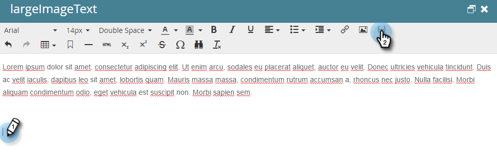

# メール内の「友達に転送」リンク {#forward-to-a-friend-link-in-emails}

「友達に転送」リンクをメールに追加すると、このリンクを通じて転送されたメールを受信した人物を追跡でき、まだデータベースに存在しない場合は自動的に新しい人物として追加できます。

例えば、キースが「友達に転送」リンクを使用して、不明な人物 Mark にメールを転送したとします。 Mark は新しいリードとして自動的に追加され、独自の Cookie が割り当てられて、そのメールと web アクティビティのすべてがリンクされます。ただし、Keith がメールクライアントで「転送」ボタンを使用している場合、Mark は誤って Keith として Cookie を取得し、そのアクティビティは Keith のものとして記録されます。

## メールテンプレートへのリンクの追加 {#add-the-link-to-an-email-template}

1. **Design Studio** に移動します。

   

1. リンクを追加するメールテンプレートを見つけて選択します。「**ドラフトを編集**」をクリックします。

   

1. 「友達に転送」リンクを表示する場所に、次の HTML コードを貼り付けます（この部分に関するヘルプが必要な場合は、web デベロッパーにお問い合わせください）。

   `<a href="{{system.forwardToFriendLink}}">Forward to Friend</a>`

   

   >[!TIP]
   >
   >
   >リンクにスタイルを追加すると、見た目を改善することができます。例：
   >
   >`<a href="{{system.forwardToFriendLink}}" style="font-family:arial, sans-serif; padding:10px; position:absolute; right:0px;">Forward to Friend</a>`

   >[!CAUTION]
   >
   >メールテンプレート内での **position:relative**  スタイル設定の使用はお勧めしません「友達に転送」ボックスの位置と表示に問題が生じる場合があります。

1. 「**ドラフトをプレビュー**」を使用して、テンプレートが希望どおりに表示されることを確認します。

   

   >[!NOTE]
   >
   >変更を適用するには、忘れずにテンプレートのドラフトを承認してください。

   そのテンプレートを使用するすべてのメールに「友達に転送」リンクが表示されるようになります。メール受信者がクリックすると、「友達に転送」ボックスを含む web 版のメールが表示されます。

   

## 個々のメールへのリンクの追加 {#add-the-link-to-an-individual-email}

「友達に転送」リンクはメールに直接追加することもできます。

1. リンクを含めるメールを開き、編集可能な領域でダブルクリックします。

   

1. リンクを表示する場所にカーソルを置き、「**トークンを挿入**」ボタンをクリックします。

   

1. **`{{system.forwardToFriendLink}}`** トークンを選択します。

   

   >[!NOTE]
   >
   >このトークンは、「友達に転送」ボックスが設定されたメールの web バージョンの URL です。

1. リンクの表示テキストを希望する内容を書き出します（例：「友達に転送」）。

   

1. Ctrl + X（Windows）または Command + X（Mac）を使用して **`{{system.forwardToFriendLink}}`** トークンを切り取ります。「友達に転送」をハイライト表示し、「リンクを挿入/編集 **ボタンをクリック** ます。

   

1. Ctrl/Cmd+V キーを使用して **`{{system.forwardToFriendLink}}`** トークンを **URL** ボックスに貼り付け、「**挿入**」をクリックします。

   

1. 編集を保存し、新しいリンクをプレビューします。

   

   >[!NOTE]
   >
   >「友達に転送」メールを受信して追加される新しい人物は、デフォルトでマーケティングメールの購読が解除されます。

## 転送アクティビティを表示 {#view-forwarding-activity}

リードのアクティビティログで、誰がメールを転送および受信したかを確認できます。

1. **`Database`** に移動します。

   

1. アクティビティを表示するリードをダブルクリックします。

   

1. 「**アクティビティログ**」タブに移動します。「**友達への転送メールを受信**」または「**友達への転送メールを送信**」をダブルクリックして詳細を確認します。

   

   >[!NOTE]
   >
   >**定義**
   >
   >「友達への転送メールを受信」の場合、「リード ID」はメールを転送したリードです。
   >
   >「友達への転送メールを送信」の場合、「リード ID」はメールを受信したリードです。

   

1. ユーザーを ID で表示するには、**ユーザー ID** をコピーして URL の末尾に貼り付けます（URL の先頭は、Marketo インスタンスによって異なります）。

   `...marketo.com/Database/loadPersonDetail?personId=`

   >[!NOTE]
   >
   >**リード ID** をクリック可能にして、今後のパッチのリードに直接リンクします。

   

   >[!NOTE]
   >
   >転送を受け取った友達が不明な人物の場合、その人物の **Source** としてマークされた「友達に転送」で新しい人物が作成されます。
   >メールがプログラムのローカルアセットである場合、そのプログラムはユーザーの **獲得プログラム** としてマークされます。

## トリガーまたは転送アクティビティを使用したフィルター {#trigger-or-filter-using-forwarding-activity}

6 つのトリガー/フィルターを使用して、フローのアクションをトリガー化したり、送受信した「友達に転送」アクティビティで人物をフィルタリングしたりできます。

スマートキャンペーンのスマートリストで「転送」を検索すると、使用可能なトリガーとフィルターが表示されます。

## 友達に転送のテスト {#test-forward-to-friend}

「友達に転送」をテストするには、転送リンクが記載されたメールを自分宛てに送信します。 必ず、**メールを送信**&#x200B;フローステップで送信してください。**テストメールを送信**&#x200B;は&#x200B;*使用しない*&#x200B;でください。
