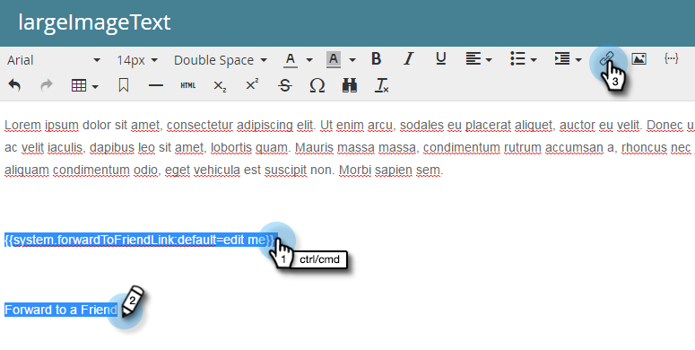

# 電子メールの友達リンクに転送{#forward-to-a-friend-link-in-emails}

電子メールに「友達に転送」リンクを追加すると、このリンクを介して転送された電子メールを受信した人を追跡でき、データベースにまだ存在しない場合は、新しい人として自動的に追加できます。

例えば、Keithが「友達に転送」リンクを使用して、未知のユーザーMarkに電子メールを転送するとします。 Markが新しいユーザーとして自動的に追加され、独自のCookieが割り当てられ、Markの電子メールおよびWebアクティビティーがリンクされます。 ただし、Keithが電子メールクライアントで「転送」ボタンを使用すると、Markは誤ってKeithとしてCookieを受け取り、そのアクティビティはKeithとしてログに記録されます。

## 電子メ追加ールテンプレートへのリンク{#add-the-link-to-an-email-template}

1. **Design Studio**&#x200B;に移動します。

   

1. リンクを追加する電子メールテンプレートを探して選択します。 「**ドラフトを編集**」をクリックします。

   

1. 「友達に転送」リンクを表示する場所に次のHTMLコードを貼り付けます（この記事に関するヘルプが必要な場合は、Web開発者にお問い合わせください）。

   `<pre data-theme="Confluence"><a href="{{system.forwardToFriendLink}}">Forward to Friend</a></pre>`

   

   >[!TIP]
   >
   >
   >リンクにスタイルを追加して、見た目をより良くすることができます。 次に例を示します。
   >
   >`<a href="{{system.forwardToFriendLink}}" style="font-family:arial, sans-serif; padding:10px; position:absolute; right:0px;">Forward to Friend</a>`

   >[!CAUTION]
   >
   >電子メールテンプレートで&#x200B;**position:relative**&#x200B;のスタイルを使用することはお勧めしません。 「友達に転送」ボックスの位置と表示に問題が生じる場合があります。

1. 「**プレビュードラフト**」をクリックして、テンプレートが希望どおりに表示されることを確認します。

   

   >[!NOTE]
   >
   >変更を適用するには、必ずテンプレートのドラフトを承認してください。

   これで、そのテンプレートを使用する電子メールはすべて「友達に転送」リンクになります。 電子メール受信者がクリックすると、「友達に転送」ボックスが付いたWebバージョンの電子メールが送信されます。

   

## 個追加々の電子メールへのリンク{#add-the-link-to-an-individual-email}

「友達に転送」リンクを電子メールに直接追加することもできます。

1. リンクを含める電子メールを開き、編集可能な領域で重複クリックします。

   

1. リンクを表示する場所にカーソルを置き、「**トークンを挿入**」ボタンをクリックします。

   

1. **`{{system.forwardToFriendLink}}`**&#x200B;トークンを選択します。

   

   >[!NOTE]
   >
   >このトークンは、「友達に転送」ボックスが付いた電子メールのWebバージョンのURLです。

1. リンクの表示テキストを書き込みます（「友達に転送」など）。

   

1. Ctrl + Xキー(Windows)またはCommand + Xキー(Mac)を使用して、**`{{system.forwardToFriendLink}}`**&#x200B;トークンを切り取ります。 「友達に転送」をハイライトし、「**リンクを挿入/編集**」ボタンをクリックします。

   

1. **`{{system.forwardToFriendLink}}`**&#x200B;トークンを&#x200B;**URL**&#x200B;ボックスに貼り付けます。Ctrl/Command+Vキーを押しながら貼り付け、**挿入**&#x200B;をクリックします。

   

1. 編集とプレビューを新しいリンクに保存します。

   

   >[!NOTE]
   >
   >「友達に転送」という電子メールを受け取って新しいユーザーが追加された場合、デフォルトでは、マーケティング電子メールの登録が解除されます。

## 表示転送アクティビティ{#view-forwarding-activity}

ユーザーのアクティビティログで、誰が電子メールを転送および受信したかを確認できます。

1. **`Database`**&#x200B;に移動します。

   

1. 表示アクティビティの対象となるユーザーを重複クリックします。

   

1. 「**アクティビティログ**」タブに移動します。 **友達への転送を受信した電子メール**&#x200B;または&#x200B;**友人への転送**&#x200B;に重複をクリックして、詳細を表示します。

   

   >[!NOTE]
   >
   >**定義**
   >
   >「友人の電子メールに転送された受信者」の場合、人物IDは電子メールを転送した人です。
   >
   >「友人の電子メールに送信」の場合、人物IDは電子メールを受信した人です。

   

1. 個人をIDで表示するには、**個人ID**&#x200B;をコピーしてURLの末尾に貼り付けます（このURLの先頭は、Marketorインスタンスに依存します）。

   `<pre data-theme="Confluence">...marketo.com/Database/loadPersonDetail?personId=</pre>`

   >[!NOTE]
   >
   >**個人ID**&#x200B;をクリック可能にし、今後のパッチでその人に直接リンクします。

   

   >[!NOTE]
   >
   >転送を受け取った友人が不明な人物の場合は、新しい人物が作成され、その人物の&#x200B;**Source**として「Forward to Friend」がマークされます。
   >電子メールがプログラムのローカルアセットの場合、プログラムは個人の&#x200B;**獲得プログラム**&#x200B;としてマークされます。

## 転送アクティビティを使用したトリガーまたはフィルタ{#trigger-or-filter-using-forwarding-activity}

トリガーフローアクションや、送受信した「友達に転送」アクティビティによるユーザーのフィルタリングに使用できるトリガー/フィルターは6つあります。

スマートキャンペーンのスマートリストで「転送」を検索すると、使用可能なトリガーとフィルターが見つかります。

## フレンドにテストフォワード{#test-forward-to-friend}

「友達に転送」をテストするには、転送リンクを記載した電子メールを送信します。 **電子メールを送信**&#x200B;のフローステップ（*a3/>から&#x200B;**テスト用電子メールを送信**ではなく*）を通じて送信するようにしてください。
