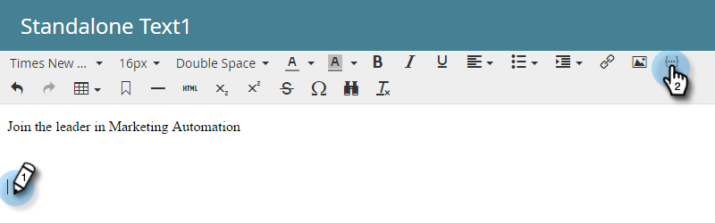

# 電子メールにカレンダーイベント(.ics)を含める {#include-a-calendar-event-ics-in-an-email}

カレンダーファイルトークンを使用すると、Marketorの電子メールにカレンダーイベント(.ics)リンクを追加できます。

>[!NOTE]
>
>**前提条件**
>
>* [予定表イベント(.ics)ファイルの作成](create-a-calendar-event-ics-file.md)

>

1. プログラムの電子メールを編集中に、トークンの移動先をクリックし、「トークンの挿入」ボタンをクリックします。

1. カレンダーファイルトークンを選択し、「 **挿入**」をクリックします。

   

   「保存」をクリックします。

   

   受信者に、次のような電子メールが届きます。

   

任務完了！
