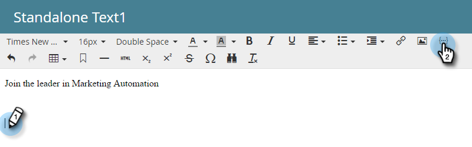
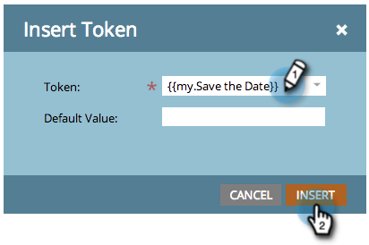
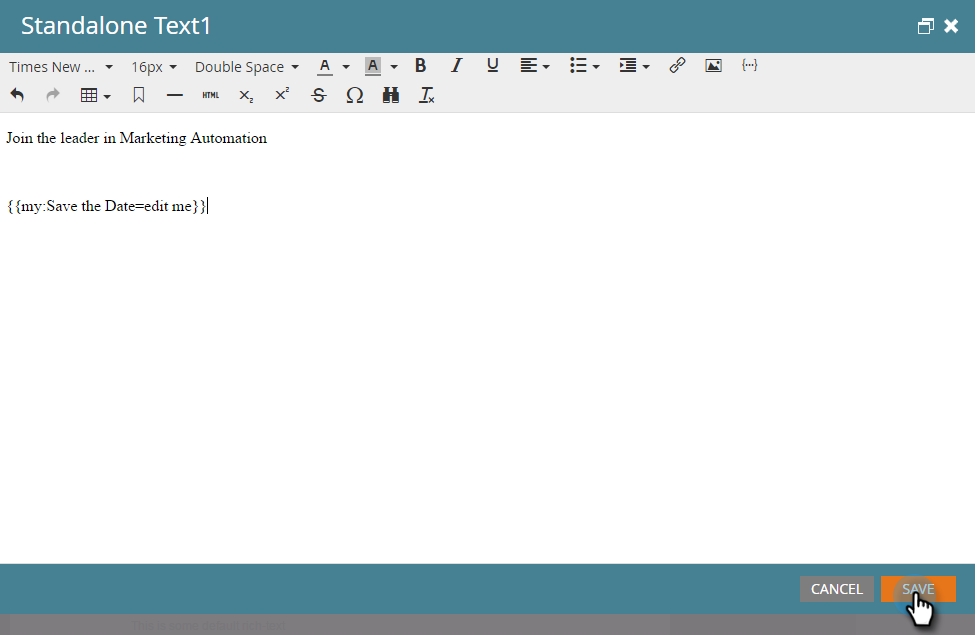

# メールにカレンダーイベント（.ics）を追加する {#include-a-calendar-event-ics-in-an-email}

カレンダーファイルトークンを使用すると、Marketo メールにカレンダーイベント（.ics）のリンクを追加できます。

>[!PREREQUISITES]
>
>[カレンダーイベント（.ics）ファイルを作成する](/help/marketo/product-docs/email-marketing/general/functions-in-the-editor/create-a-calendar-event-ics-file.md)

1. プログラムのメールの編集中に、トークンを挿入する場所をクリックし、「**トークンを挿入**」ボタンをクリックします。

1. カレンダーファイルトークンを選択して「**[!UICONTROL 挿入]**」をクリックします。

   

1. 「**[!UICONTROL 保存]**」をクリックします。

   

   受信者に、次のようなメールが届きます。

   

任務完了です。
