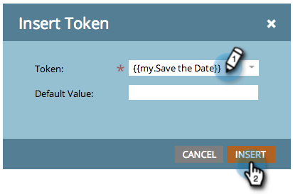
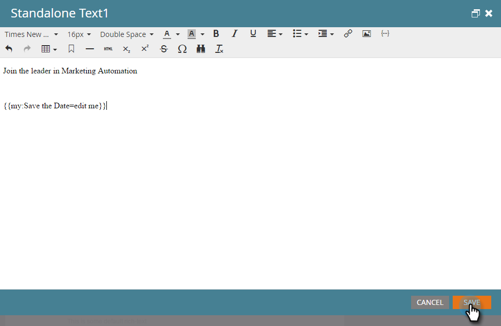

# 電子メールにカレンダーイベント(.ics)を含める{#include-a-calendar-event-ics-in-an-email}

カレンダーファイルトークンを使用すると、Marketorの電子メールにカレンダーイベント(.ics)リンクを追加できます。

>[!PREREQUISITES]
>
>[予定表イベント(.ics)ファイルの作成](/help/marketo/product-docs/email-marketing/general/functions-in-the-editor/create-a-calendar-event-ics-file.md)

1. プログラムの電子メールを編集中に、トークンの移動先をクリックし、「トークンの挿入」ボタンをクリックします。

1. カレンダーファイルトークンを選択し、「**挿入**」をクリックします。

   

1. 「**保存**」をクリックします。

   

   受信者に、次のような電子メールが届きます。

   

任務完了！
