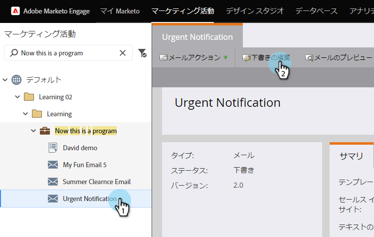
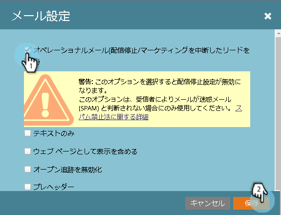

# 電子メールの操作{#make-an-email-operational}

操作電子メールでは、「未登録」および「マーケティングの一時停止」のステータスが無視されます。 彼らは何を送っても送る。

>[!NOTE]
>
>操作用の電子メールは、通信制限の対象となりません。

1. 電子メールを探し、選択して「ドラフトを編集」をクリックします。

>[!NOTE]
>
>**Reminder**
>
>操作用の電子メールは、重要な電子メールおよび自動応答にのみ使用する必要があります。 マーケティング用の電子メールは使用しません。

1. エディターが開いたら、「**電子メール設定**」をクリックします。

   

1. 「**操作用電子メール**」をチェックし、「**保存**」をクリックします。

   

>[!CAUTION]
>
>操作用電子メールがエンゲージメントプログラムで機能しないように設計されていた問題を修正しました。 したがって、エンゲージメントプログラムは電子メールの操作ステータスを無視します。 彼らと一緒に仕事をする際は、それを覚えておいて下さい。

変更を有効にするために、この電子メールを承認するのを忘れないでください。 [電子メール](../../../../product-docs/email-marketing/general/creating-an-email/approve-an-email.md)を&lt;a0/>承認する方法を説明します。