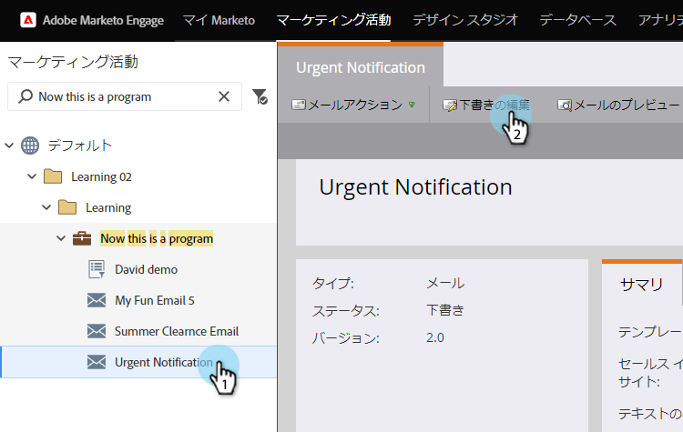
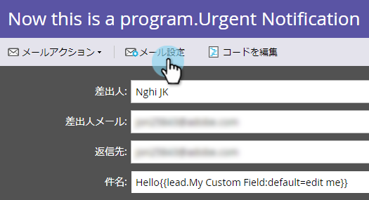
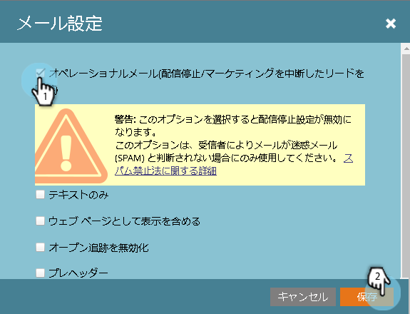

# メールをオペレーショナルメールにする {#make-an-email-operational}

オペレーショナルメールでは、「登録解除済み」および「マーケティング中断」のステータスが無視されます。 また、通信制限の対象となりません。 これらはどんな場合でも送信されます。

>[!NOTE]
>
>オペレーショナルメールは、通信制限にカウントされません。 例えば、週に 1 通のメールしか受信できず、既にマーケティングメールを送信した場合でも、必要に応じてオペレーショナルメールを送信できます。

1. 目的のメールを選択して、「**[!UICONTROL ドラフトを編集]**」をクリックします。

>[!NOTE]
>
>オペレーショナルメールは、重要なメールと自動応答者に対してのみ使用してください。 マーケティングメール用ではありません。

1. エディターが開いたら、「**[!UICONTROL メール設定]**」をクリックします。

   

1. 「**[!UICONTROL オペレーショナルメール]**」のチェックをオンにして、「**[!UICONTROL 保存]**」をクリックします。

   

>[!CAUTION]
>
>オペレーショナルメールは、エンゲージメントプログラムと連携するために設計されたものではありません。 したがって、エンゲージメントプログラムはメールのオペレーショナル状態を無視します。 使用する際は、その点に留意してください。

変更を有効にするために、忘れずにこのメールを承認してください。 [メールの承認](/help/marketo/product-docs/email-marketing/general/creating-an-email/approve-an-email.md)方法を参照してください。
