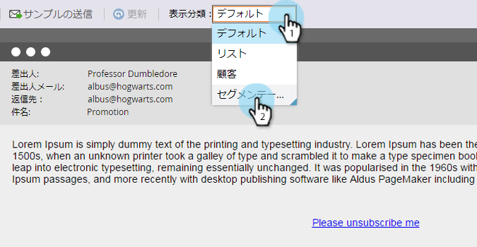
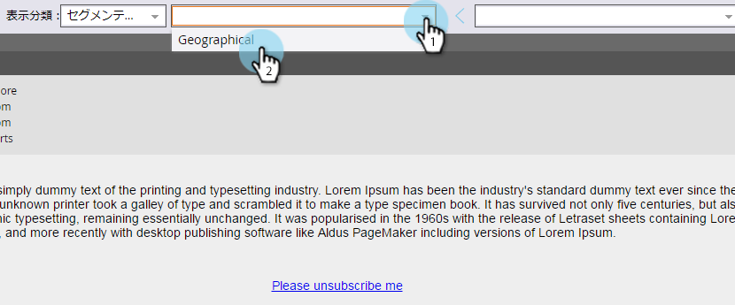
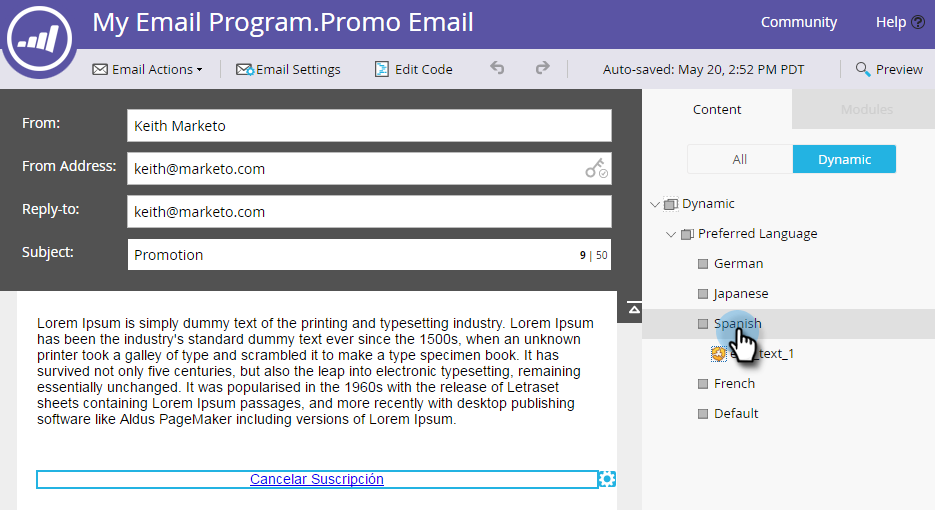

# 動的コンテンツを含むメールのプレビュー {#preview-an-email-with-dynamic-content}

動的コンテンツを追加した後にメールをプレビューして確認します。

1. メールを選択し、「**[!UICONTROL メールのプレビュー]**」をクリックします。

   

1. 「**[!UICONTROL 閲覧方法]**」ドロップダウンをクリックし、プレビューする動的コンテンツのタイプを選択します。

   

1. 新しいドロップダウンが表示されます。 クリックして、特定のコンテンツを選択します。

   

1. 矢印を使用して、オプション間をスクロールします。

   

メールエディターで動的コンテンツを直接プレビューすることもできます。

1. 「**[!UICONTROL コンテンツ]**」で、「**[!UICONTROL 動的]**」タブをクリックします。

   

1. プレビューするコンテンツをクリックします。

   

これで完了です。 メールをプレビューして、コンテンツが希望どおりであることを確認します。
