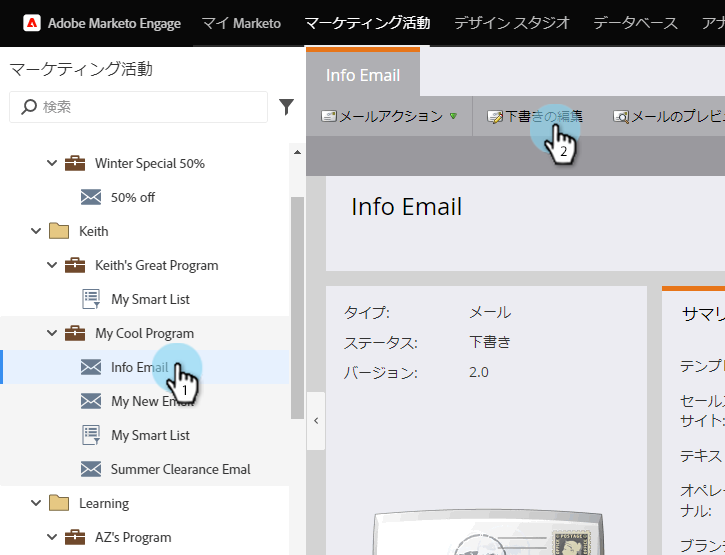
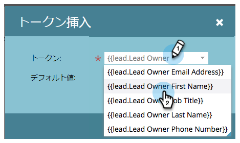
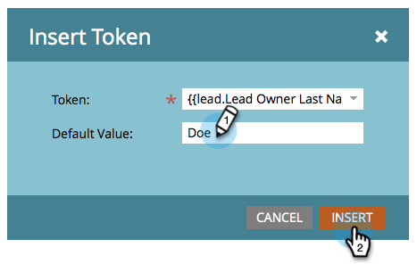

# リード所有者からのメール送信 {#send-emails-from-the-lead-owner}

リード所有者の代わりにリードにメールを送信する場合はどうすればよいですか？  手順は次のとおりです。

1. 目的のメールを選択して、「**[!UICONTROL ドラフトを編集]**」をクリックします。

   

1. 「**[!UICONTROL 送信者]**」フィールドをクリックして（既存の名前を削除）、「**トークンを挿入**」ボタンをクリックします。

   

1. 「`{{lead.Lead Owner`」を入力し始めて **`{{lead.Lead Owner First Name}}`** トークンを選択します。

   

1. リードにまだリード所有者がいない場合のデフォルト値を入力し、「**[!UICONTROL 挿入]**」をクリックします。

   

1. 最初のトークンの後をクリックし、スペースを追加して、「**トークンを挿入**」ボタンをクリックします。

   

1. 「`{{lead.Lead Owner`」を入力し始めて **`{{lead.Lead Owner Last Name}}`** トークンを選択します。

   

1. リードにまだリード所有者がいない場合のデフォルト値を入力し、「**[!UICONTROL 挿入]**」をクリックします。

   

   >[!TIP]
   >
   >姓と名のトークンの間にスペースを追加していることを確認してください。

1. 「**[!UICONTROL 差出人アドレス]**」フィールドをクリックして（既存のメールアドレスを削除）、「**トークンを挿入**」ボタンをクリックします。

   

1. 「`{{lead.Lead Owner`」を入力し始めて **`{{lead.Lead Owner Email Address}}`** トークンを選択します。

   

1. リードにまだリード所有者がいない場合のデフォルト値を入力し、「**[!UICONTROL 挿入]**」をクリックします。

   

1. **[!UICONTROL 返信先]**&#x200B;および&#x200B;**[!UICONTROL 件名]**&#x200B;のフィールドが入力されていることを確認してください。これで完了です。

   
